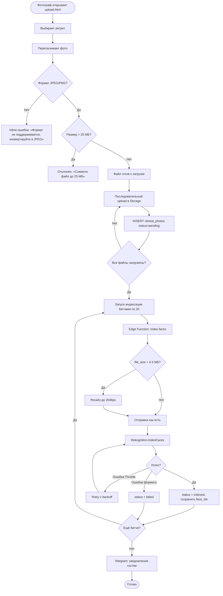
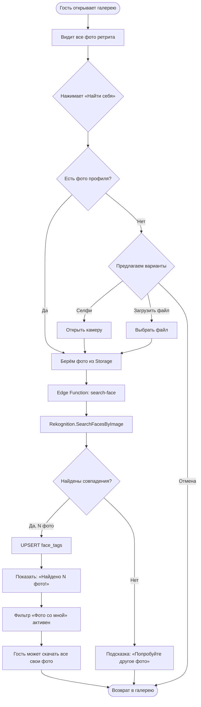

# Photo Gallery & Face Search — Функциональные требования

**Версия**: 1.6 (убран HEIC, убрано авто-сжатие на клиенте, фотограф сжимает сам; Telegram-бот из существующего проекта)
**Дата**: 2026-02-08
**Источник**: Photo-gallery-business-logic Short (PDF) + PLAN-dev-and-photos.md
**Статус**: Согласование

---

## Проблема

После каждого ретрита фотограф делает сотни фото. Сейчас фото раздаются через Google Drive или чат — хаотично, без структуры. Гости не могут быстро найти фото с собой среди 700 снимков. Часть гостей вообще не получает фото, потому что не видит ссылку в чате.

## Решение

Встроенная фото-галерея в системе ашрама с AI-поиском лиц. Фотограф загружает фото в админке, гости видят галерею в Guest Portal и находят себя за 2 секунды одной кнопкой. Telegram-бот уведомляет когда появляются новые фото.

## Метрики успеха

| Метрика | Цель | Как измеряем |
|---------|------|-------------|
| Доля гостей, просмотревших фото | > 70% | face_search_log / retreat_registrations |
| Доля гостей, нашедших себя | > 40% | face_tags COUNT DISTINCT vaishnava_id |
| Время от загрузки до просмотра | < 5 мин | uploaded_at → первый SELECT по retreat_id |
| Время поиска «Найти себя» | < 3 сек | search-face response time |
| Подписка на Telegram-бота | > 50% | vaishnavas WHERE telegram_chat_id IS NOT NULL |

---

## Акторы

| Роль | Кто это | Что делает в системе |
|------|---------|---------------------|
| **Фотограф** | Человек с камерой на ретрите. Имеет отдельную роль (`upload_photos`). Не суперпользователь | Загружает фото пачками, удаляет неудачные, следит за индексацией |
| **Гость** | Участник ретрита. Зарегистрирован через Guest Portal | Смотрит все фото, ищет себя, скачивает, подключает Telegram |
| **Система** | Бэкенд (Edge Functions + AWS Rekognition + Telegram Bot) | Индексирует лица, ищет совпадения, отправляет уведомления |
| **Администратор** | Суперпользователь системы | Управляет permission фотографа, видит аналитику поисков |

---

## User Stories

### US-1: Фотограф загружает фото с ретрита

```
Как фотограф,
я хочу загрузить пачку фото за один раз,
чтобы не тратить время на загрузку по одному.

Acceptance Criteria:
- Given я на странице загрузки фото и выбрал ретрит
- When я перетаскиваю 100 фото в зону загрузки
- Then система показывает превью всех файлов
  AND я вижу прогресс загрузки (34/100, скорость, текущий файл)
  AND файлы с неподдерживаемым форматом (не JPEG/PNG) помечены с пояснением
  AND файлы > 25 МБ отклоняются с сообщением: «Сожмите файл до 25 МБ»
  AND после загрузки автоматически запускается индексация лиц
  AND я могу закрыть страницу — незавершённая индексация продолжится позже
```

### US-2: Гость просматривает фотогалерею

```
Как гость ретрита,
я хочу видеть все фото с моего ретрита,
чтобы сохранить воспоминания.

Acceptance Criteria:
- Given я авторизован в Guest Portal и зарегистрирован на ретрит
- When я открываю раздел «Фото»
- Then я вижу все фото ретрита в виде сетки с миниатюрами
  AND фото сгруппированы по дням
  AND по клику на фото открывается полноразмерная версия
  AND я могу скачать отдельное фото
  AND я вижу кнопку «Найти себя»
```

### US-3: Гость ищет себя на фото

```
Как гость ретрита,
я хочу найти все фото, где я есть,
чтобы не листать 700 снимков вручную.

Acceptance Criteria:
- Given я в галерее ретрита и у меня есть фото профиля
- When я нажимаю «Найти себя»
- Then за 1-3 секунды система показывает все фото, где я найден
  AND рядом с каждым фото — процент уверенности
  AND активируется фильтр «Фото со мной»
  AND я могу скачать все свои фото

- Given у меня НЕТ фото профиля
- When я нажимаю «Найти себя»
- Then система предлагает сделать селфи (мобильный) или загрузить фото
  AND после загрузки — поиск запускается автоматически

- Given поиск не нашёл совпадений
- When результат — 0 фото
- Then система показывает подсказку: «Попробуйте другое фото (крупный план, хорошее освещение)»
```

### US-4: Гость подключает Telegram-уведомления

```
Как гость ретрита,
я хочу получать уведомления в Telegram когда появляются новые фото,
чтобы не проверять сайт вручную.

Acceptance Criteria:
- Given я в Guest Portal
- When я нажимаю «Подключить уведомления»
- Then вижу кнопку/ссылку для перехода в Telegram-бота
  AND после отправки /start TOKEN в боте — получаю подтверждение
  AND в Guest Portal статус меняется на «Подключено»

- Given я подключил бота и фотограф загрузил новые фото
- When индексация завершена
- Then я получаю сообщение: «Новые фото с ретрита! Посмотреть →»

- Given я хочу отключить уведомления
- When я отправляю /stop боту ИЛИ нажимаю «Отключить» в Guest Portal
- Then уведомления прекращаются
```

### US-5: Фотограф удаляет неудачные фото

```
Как фотограф,
я хочу удалить некачественные фото,
чтобы гости видели только хорошие снимки.

Acceptance Criteria:
- Given я на странице управления фото
- When я выбираю одно или несколько фото и нажимаю «Удалить»
- Then система спрашивает подтверждение: «Удалить N фото? Нельзя отменить»
  AND после подтверждения — фото, файлы и данные о лицах удалены полностью
  AND удалённые лица не всплывают в результатах поиска
```

### US-6: Гость без регистрации на ретрит не видит фото

```
Как система,
я хочу показывать фото только участникам ретрита,
чтобы обеспечить приватность.

Acceptance Criteria:
- Given пользователь НЕ зарегистрирован на данный ретрит
- When он пытается открыть галерею этого ретрита
- Then он не видит фото (RLS блокирует)
  AND получает сообщение: «Фото доступны только участникам ретрита»
```

---

## User Flows

### Flow 1: Загрузка и индексация фото (Фотограф)

```
Фотограф                          Система                         AWS Rekognition
    │                                 │                                 │
    ├─→ Открывает photos/upload.html  │                                 │
    ├─→ Выбирает ретрит              │                                 │
    ├─→ Перетаскивает 100 фото       │                                 │
    │                                 │                                 │
    │   ┌─ Подготовка на клиенте ─┐  │                                 │
    │   │ Формат: JPEG/PNG?       │  │                                 │
    │   │ ❌ 2 файла: неверный    │  │                                 │
    │   │    формат (HEIC,BMP,..) │  │                                 │
    │   │ ❌ 1 файл > 25 МБ →    │  │                                 │
    │   │    отклонён             │  │                                 │
    │   │ ✅ 97 файлов готовы     │  │                                 │
    │   └─────────────────────────┘  │                                 │
    │                                 │                                 │
    ├─→ Нажимает «Загрузить»         │                                 │
    │                                 │                                 │
    │   ┌─ Последовательный upload ─┐ │                                 │
    │   │ Файл 1/97 → Storage      ├─┤─→ INSERT retreat_photos         │
    │   │ Файл 2/97 → Storage      ├─┤─→ INSERT retreat_photos         │
    │   │ ...                       │ │                                 │
    │   │ [████████░░░] 34/97       │ │                                 │
    │   │ Файл 97/97 → Storage     ├─┤─→ INSERT retreat_photos         │
    │   └───────────────────────────┘ │                                 │
    │                                 │                                 │
    │   ┌─ Автоиндексация батчами ──┐ │                                 │
    │   │ Batch 1 (фото 1-20)      ├─┤─→ Edge Function index-faces ──→├─→ IndexFaces ×20
    │   │ Batch 2 (фото 21-40)     ├─┤─→ Edge Function index-faces ──→├─→ IndexFaces ×20
    │   │ ...                       │ │   (ресайз >4.5 МБ)             │
    │   │ [██████░░░░] 60/97        │ │                                 │
    │   │ Batch 5 (фото 81-97)     ├─┤─→ Edge Function index-faces ──→├─→ IndexFaces ×17
    │   └───────────────────────────┘ │                                 │
    │                                 │                                 │
    │                                 ├─→ Telegram: «Новые фото!» ──→ гостям
    │                                 │                                 │
    ✅ Готово: 97 фото, 247 лиц      │                                 │
```

### Flow 2: Поиск себя на фото (Гость)

```
Гость                              Система                         AWS Rekognition
    │                                 │                                 │
    ├─→ Открывает Guest Portal        │                                 │
    ├─→ Раздел «Фото»               │                                 │
    │                                 │                                 │
    │   ┌─ Галерея ──────────────┐   │                                 │
    │   │ 📷📷📷📷📷📷📷📷    │   │                                 │
    │   │ 📷📷📷📷📷📷📷📷    │   │                                 │
    │   │ День 1 · День 2 · ...  │   │                                 │
    │   │                        │   │                                 │
    │   │    [🔍 Найти себя]     │   │                                 │
    │   └────────────────────────┘   │                                 │
    │                                 │                                 │
    ├─→ Нажимает «Найти себя»        │                                 │
    │                                 │                                 │
    │   ┌─ Есть фото профиля? ──┐    │                                 │
    │   │ ДА → берём из Storage  │    │                                 │
    │   │ НЕТ → предлагаем:     │    │                                 │
    │   │   📱 Сделать селфи     │    │                                 │
    │   │   📁 Загрузить файл    │    │                                 │
    │   └────────────────────────┘    │                                 │
    │                                 │                                 │
    │                                 ├─→ Edge Function search-face     │
    │                                 │   1. Загрузить фото гостя      │
    │                                 │   2. Ресайз если > 4.5 МБ     │
    │                                 ├──────────────────────────────→  │
    │                                 │   SearchFacesByImage            │
    │                                 │   (1 вызов, 1-2 сек)           │
    │                                 │  ←──────────────────────────── │
    │                                 │   3. Сохранить face_tags       │
    │                                 │   4. Вернуть photo_ids         │
    │                                 │                                 │
    │   ┌─ Результат ────────────┐    │                                 │
    │   │ «Найдено 23 фото!»    │    │                                 │
    │   │                        │    │                                 │
    │   │ [✅ Фото со мной]      │    │                                 │
    │   │ 🟢📷 🟢📷 🟢📷 📷    │    │                                 │
    │   │ 🟢📷 📷 🟢📷 📷 📷   │    │                                 │
    │   │                        │    │                                 │
    │   │ 🟢 = с вами (95%)     │    │                                 │
    │   └────────────────────────┘    │                                 │
    │                                 │                                 │
    ├─→ Скачивает «Все мои фото»     │                                 │
    ✅                                │                                 │
```

### Flow 3: Подключение Telegram-уведомлений (Гость)

```
Гость                    Guest Portal              Edge Function           Telegram
  │                          │                          │                      │
  ├─→ «Подключить            │                          │                      │
  │    уведомления»          │                          │                      │
  │                          ├─→ Генерирует TOKEN       │                      │
  │                          │   (UUID, TTL 15 мин)     │                      │
  │                          │                          │                      │
  │   ┌──────────────────┐   │                          │                      │
  │   │ Подключить ТГ:   │   │                          │                      │
  │   │ [Открыть бота →] │   │                          │                      │
  │   │ t.me/rupaseva_bot│   │                          │                      │
  │   │ ?start=abc123... │   │                          │                      │
  │   └──────────────────┘   │                          │                      │
  │                          │                          │                      │
  ├─→ Нажимает ссылку ──────────────────────────────────────────────→ Telegram
  │                          │                          │                      │
  ├─→ /start abc123...  ──────────────────────────────────────────→ webhook
  │                          │                          │                      │
  │                          │                          ├─→ Валидация TOKEN    │
  │                          │                          │   ✅ валиден         │
  │                          │                          │                      │
  │                          │                          ├─→ UPDATE vaishnavas  │
  │                          │                          │   SET telegram_chat_id
  │                          │                          │                      │
  │                          │                          ├─→ Ответ бота ──────→ │
  │                          │                          │   «Привет, Радха!    │
  │  ←──────────────────────────────────────────────────│    Уведомления       │
  │   «Уведомления                                     │    подключены ✓»     │
  │    подключены ✓»         │                          │                      │
  │                          │                          │                      │
  │   ... позже ...          │                          │                      │
  │                          │                          │                      │
  │                          │   Фотограф загрузил      │                      │
  │                          │   новые фото             │                      │
  │                          │                          ├─→ send-notification  │
  │  ←────────────────────────────────────────────────── «Новые фото с        │
  │   push в Telegram        │                          │  ретрита! →»        │
  ✅                         │                          │                      │
```

### Flow 4: Удаление фото (Фотограф)

```
Фотограф                       Система                      AWS Rekognition
    │                              │                              │
    ├─→ photos/manage.html         │                              │
    ├─→ Выбирает 5 фото           │                              │
    ├─→ «Удалить выбранные (5)»   │                              │
    │                              │                              │
    │   ┌────────────────────┐     │                              │
    │   │ Удалить 5 фото?   │     │                              │
    │   │ Нельзя отменить.  │     │                              │
    │   │ [Отмена] [Удалить]│     │                              │
    │   └────────────────────┘     │                              │
    │                              │                              │
    ├─→ Подтверждает               │                              │
    │                              ├─→ Edge Function delete-photos │
    │                              │   1. Получить face_ids       │
    │                              ├──────────────────────────→   │
    │                              │   DeleteFaces(face_ids)      │
    │                              │  ←────────────────────────── │
    │                              │   2. DELETE face_tags        │
    │                              │   3. DELETE photo_faces      │
    │                              │   4. DELETE retreat_photos   │
    │                              │   5. Storage.remove(paths)   │
    │                              │                              │
    ✅ «5 фото удалено»           │                              │
```

---

## BPMN-диаграммы (Mermaid)

### Процесс загрузки фото



### Процесс поиска себя



### Процесс подключения Telegram


---

## Приоритизация (MoSCoW)

**В работу берём: Must Have + Should Have. Could Have — после MVP.**

### Must Have

- Загрузка фото пачкой (drag & drop + авто-сжатие)
- Просмотр галереи с миниатюрами
- Удаление фото (с каскадом Rekognition + Storage + БД)
- Индексация лиц (IndexFaces, батчи по 20)
- Поиск себя (SearchFacesByImage, мгновенный)
- RLS: фото видят только участники ретрита
- Роль «Фотограф» (permission `upload_photos`)

### Should Have

- Telegram-уведомления (бот + привязка + /start /stop)
- Fallback: загрузка файла для гостей без фото профиля
- Bulk delete с мультивыбором

### Could Have (после MVP)

- Группировка фото по дням ретрита
- Прогрессбар загрузки (скорость, ETA, пауза/отмена)
- Кнопка «Переиндексировать» (пересоздание коллекции)
- Прогрессбар индексации
- Скачивание всех своих фото zip-архивом
- Подписи к фото (caption)
- Аналитика поисков (face_search_log)
- QR-код для Telegram на ресепшене

### Won't Have

- Видео
- Комментарии к фото
- Лайки / избранное
- Поиск по нескольким ретритам
- Telegram как интерфейс поиска (только уведомления)

---

## Нефункциональные требования

### Производительность

| Параметр | Требование |
|----------|-----------|
| Загрузка страницы галереи | < 3 сек (thumbnails через CDN) |
| Поиск «Найти себя» | < 3 сек (один вызов Rekognition) |
| Upload 100 фото | Последовательно, с retry |
| Индексация 100 фото | ~50-75 сек (5 батчей по 20) |

### Безопасность

| Параметр | Реализация |
|----------|-----------|
| Доступ к фото | RLS: только участники ретрита |
| Загрузка/удаление | Permission `upload_photos` |
| AI-таблицы (photo_faces, face_tags) | Запись: только service_role (Edge Functions) |
| Telegram-привязка | Одноразовый TOKEN с TTL 15 мин |
| AWS ключи | Supabase Edge Function Secrets |

### Ограничения

| Параметр | Значение |
|----------|---------|
| Макс. размер файла | 25 МБ (больше — отклоняется, фотограф сжимает сам) |
| Форматы | JPEG, PNG (остальные, включая HEIC, отклоняются с пояснением) |
| Макс. лиц на фото (Rekognition) | Индексируются все обнаруженные |
| Мин. размер лица (Rekognition) | 80×80 px |
| Порог уверенности поиска | 80% |
| TTL Telegram-токена | 15 минут |

---

## Фаза 1. Галерея (без AI)

### 1.1 Структура данных (DB)

**Таблица `retreat_photos`:**

| Поле | Тип | Описание |
|------|-----|----------|
| id | UUID PK | |
| retreat_id | UUID FK → retreats | Ретрит |
| storage_path | TEXT | Путь в Supabase Storage: `{retreat_id}/{uuid}.jpg` |
| uploaded_by | UUID FK → profiles | Кто загрузил |
| uploaded_at | TIMESTAMPTZ | Когда загружено |
| width | INT | Ширина (px) |
| height | INT | Высота (px) |
| file_size | INT | Размер (байты) |
| day_number | INT | День ретрита (для группировки) |
| caption | TEXT | Подпись (опционально) |
| index_status | TEXT | `pending` / `processing` / `indexed` / `failed` |
| index_error | TEXT | Текст ошибки если failed |

**RLS-политики:**

- SELECT: участники ретрита (retreat_registrations.status IN ('guest', 'team'))
- INSERT/DELETE: пользователи с permission `upload_photos`
- Суперпользователи обходят RLS

### 1.2 Storage (bucket `retreat-photos`)

- Public bucket в Supabase Storage
- Конвенция путей: `{retreat_id}/{uuid}.jpg`
- Thumbnails: CDN Image Transforms (генерация на лету, без хранения)
- Кэш: `Cache-Control: max-age=31536000` (1 год, фото не меняются)

### 1.3 Загрузка фото (frontend + Edge Function)

**Подготовка на клиенте (ПЕРЕД upload):**

- Допустимые форматы: JPEG, PNG
  - HTML: `<input type="file" accept="image/jpeg,image/png" multiple>`
- Неподдерживаемые форматы (HEIC, BMP, TIFF, GIF, WebP и пр.):
  - Файл помечается красным с пояснением: «Формат {ext} не поддерживается. Конвертируйте в JPEG»
  - Исключается из загрузки
- Ограничение размера: **25 МБ** на файл
  - Файлы > 25 МБ отклоняются с пояснением: «{name} слишком большой ({size} МБ). Сожмите до 25 МБ»
  - Фотограф самостоятельно сжимает фото перед загрузкой (Lightroom export, качество 85-90%)
  - Клиентское сжатие не выполняется — файл загружается как есть
- Остальные файлы НЕ блокируются из-за проблем с отдельными файлами

**Загрузка:**

- Последовательная (по одному файлу — стабильнее на плохом интернете)
- Простой счётчик: «Загружено 34/100»
- Retry до 3 раз с exponential backoff при ошибке
- Сохранение метаданных в БД (width, height, file_size)

**Роль «Фотограф»:**

- Отдельная permission `upload_photos` в таблице permissions
- Не суперпользователь — только загрузка/удаление фото

### 1.4 Просмотр галереи

- Получение списка фото по retreat_id
- Отображение сеткой (thumbnails через CDN Image Transforms: width=400)
- Увеличение по клику (полный размер)
- Скачивание отдельного фото

### 1.5 Удаление фото (админ)

**Способ удаления: жёсткое (hard delete)**

Обоснование: soft delete (deleted_at) усложняет каскад с Rekognition и не имеет практического смысла для фото ретрита. Восстановление из корзины не требуется.

**UI:**

- Кнопка «Удалить» на фото + диалог подтверждения
- Bulk delete: выбор нескольких фото → «Удалить выбранные (N)»

**Проверка прав:** permission `upload_photos` (backend, RLS)

**Каскад удаления (Edge Function `delete-photos`):**

1. Получить все face_id из photo_faces для удаляемых фото
2. Rekognition.DeleteFaces(CollectionId, FaceIds) — удалить лица из коллекции
3. DELETE FROM face_tags WHERE photo_id = ...
4. DELETE FROM photo_faces WHERE photo_id = ... (или CASCADE)
5. DELETE FROM retreat_photos WHERE id = ...
6. supabase.storage.from('retreat-photos').remove([storage_path])

**Обработка ошибок удаления:**

- Если файл уже удалён в Storage — продолжаем (удаляем запись в БД, логируем warning)
- Если ошибка Storage — показать пользователю: «Не удалось удалить файл {name} из хранилища. Запись в базе сохранена. Обратитесь к администратору»
- Если ошибка Rekognition.DeleteFaces — продолжаем (лица-«сироты» безвредны, не вернутся в поиск без фото)
- Каскад НЕ прерывается из-за ошибки одного шага — best-effort cleanup

### Чеклист Фазы 1

**Must Have:**

- [ ] Роль «Фотограф» (permission `upload_photos`)
- [ ] Миграция: таблица `retreat_photos`
- [ ] Supabase Storage bucket `retreat-photos` + RLS
- [ ] RLS на retreat_photos (участники читают, фотограф пишет)
- [ ] Admin: upload.html — drag & drop, валидация формата/размера, последовательная загрузка с retry
- [ ] Admin: manage.html — удаление фото (каскад Storage + БД)
- [ ] Guest Portal: галерея фото ретрита
- [ ] Thumbnails через CDN Image Transforms

**Should Have:**

- [ ] Bulk delete: мультивыбор фото + «Удалить выбранные (N)»
- [ ] Скачивание отдельного фото

### Оценка Фазы 1

| # | Задача | Тип | Обычная (ч) | Кат. | Мульт | H+C (ч) | Обоснование |
|---|--------|-----|-------------|------|-------|---------|-------------|
| **Must Have** | | | | | | | |
| 1.1 | Permission `upload_photos` (миграция + JS-проверка) | DB+JS | 1.0 | A | 5x | 0.20 | Паттерн проекта (Layout.hasPermission) |
| 1.2 | Миграция `retreat_photos` (11 полей, FK, индексы) | DB | 1.5 | A | 6x | 0.25 | SQL-генерация, знакомая структура |
| 1.3 | Storage bucket `retreat-photos` (Dashboard + policies) | DevOps | 1.5 | D | 1x | 1.50 | Ручная настройка в Supabase Dashboard |
| 1.4 | RLS на `retreat_photos` (SELECT участники, INSERT/DELETE фотограф) | DB | 1.5 | A | 5x | 0.30 | SQL policies, паттерн проекта |
| 1.5 | upload.html: drag&drop + валидация форматов/размера (25 МБ) + sequential upload + retry 3x + метаданные | Frontend | 3.5 | B | 3x | 1.17 | Без клиентского сжатия — только валидация + upload logic |
| 1.6 | manage.html: UI сетка + одиночное удаление + confirm + каскад (DB + Storage) | Full-stack | 3.0 | B | 3.5x | 0.86 | CRUD + Storage cleanup, без Rekognition |
| 1.7 | Guest Portal: галерея (grid + lightbox + фильтр по ретриту) | Frontend | 3.0 | A | 5x | 0.60 | DaisyUI grid, стандартный паттерн |
| 1.8 | CDN Image Transforms (thumbnail конфигурация + интеграция) | DevOps+FE | 1.0 | B | 4x | 0.25 | Supabase CDN — документированная фича |
| **Should Have** | | | | | | | |
| 1.9 | Bulk delete: чекбоксы + toolbar + «Удалить выбранные (N)» | Full-stack | 2.0 | B | 3.5x | 0.57 | UI мультивыбор + batch delete |
| 1.10 | Скачивание отдельного фото (кнопка download) | Frontend | 0.5 | A | 8x | 0.06 | Тривиально |
| | **Итого Фаза 1** | | **18.5** | | | **4.73** | |
| | **+ 15% overhead (ревью, интеграция)** | | | | | **5.4** | |

**Итого Фаза 1: ~18.5 часов (обычный dev, 6 дней) / ~5.4 часов (Human+Claude, 2 дня)**

---

## Фаза 2. Распознавание лиц (AI)

### 2.1 Интеграция AWS Rekognition

- AWS SDK в Edge Functions (Deno)
- Ключи: Supabase Edge Function Secrets (AWS_ACCESS_KEY_ID, AWS_SECRET_ACCESS_KEY, AWS_REGION=ap-south-1)
- IAM user: `srsk-rekognition` (policy: `SrskRekognitionOnly`)
- Статус: **ГОТОВО** (настроено 07.02.2026)

### 2.2 Коллекции лиц по ретритам

- Одна коллекция на ретрит: `retreat_{retreat_id}`
- Создаётся при первом вызове index-faces для ретрита
- Проверка существования: try CreateCollection, catch AlreadyExists
- AI включён для всех ретритов по умолчанию (без отдельного переключателя)
  - Обоснование: toggle «включить AI» усложняет UX без пользы. Индексация происходит только при загрузке фото — если фото не загружены, AI не работает автоматически

### 2.3 Индексация фото (IndexFaces)

**Триггер:** фронтенд вызывает Edge Function после batch upload (или кнопка «Индексировать оставшиеся» для pending фото).

**Ресайз перед отправкой в Rekognition:**

- AWS Rekognition принимает максимум **5 МБ** на изображение
- Edge Function `index-faces` ОБЯЗАНА ресайзить фото перед отправкой:
  1. Скачать оригинал из Storage
  2. Если file_size > 4.5 МБ — ресайзить до max 2048px по длинной стороне (качество 85%)
  3. Отправить ресайзнутое в Rekognition
  4. Оригинал в Storage НЕ трогать (хранится как есть)
- Библиотека для ресайза в Deno: `sharp` (через npm:sharp) или `imagescript`

**Батчинг:**

- Батчи по 20 фото (Sequential, не Parallel)
- Каждый батч — отдельный вызов Edge Function (~10-15 сек)
- Фронтенд вызывает в цикле, показывает прогресс
- Фотограф НЕ обязан ждать — может закрыть страницу

**Retry + backoff для Rekognition API:**

- При ошибке AWS (ThrottlingException, InternalServerError) — retry до 3 раз
- Backoff: 1с → 2с → 4с (exponential)
- При ProvisionedThroughputExceededException — backoff 5с → 10с → 20с
- При InvalidImageFormatException — пометить фото как `failed`, не ретраить

**Что сохраняем:**

| Таблица | Поля | Описание |
|---------|------|----------|
| photo_faces | photo_id, rekognition_face_id, bbox_x/y/w/h | Связь фото ↔ лицо в коллекции |
| retreat_photos.index_status | pending → processing → indexed / failed | Статус индексации |
| retreat_photos.index_error | TEXT | Текст ошибки если failed |

### 2.4 Поиск себя (SearchFacesByImage)

**Что делает пользователь:**

Нажимает «Найти себя» в Guest Portal.

**Источник фото для поиска — 3 уровня fallback:**

1. **Фото профиля** (vaishnava-photos bucket) — основной вариант
2. **Селфи прямо сейчас** — если фото профиля нет:
   - Мобильный: `<input type="file" accept="image/*" capture="user">`
   - Десктоп: загрузить файл
   - Фото используется только для поиска (не сохраняется в профиль, если гость не хочет)
3. **Нет возможности** — кнопка неактивна, подсказка: «Загрузите фото профиля, чтобы AI мог найти вас на фотографиях ретрита»

**Что делает система (Edge Function `search-face`):**

1. Загружает фото гостя из Storage (или принимает загруженное селфи)
2. Ресайз если > 4.5 МБ (аналогично index-faces)
3. Rekognition.SearchFacesByImage(CollectionId=retreat_{id}, FaceMatchThreshold=80, MaxFaces=100)
4. По FaceId → JOIN photo_faces → photo_id
5. UPSERT в face_tags (ON CONFLICT DO UPDATE SET confidence)
6. INSERT в face_search_log
7. Возвращает { matched_photo_ids, total }

**Время ответа:** 1-2 секунды (один вызов Rekognition)

**При 0 совпадений:** подсказка «Попробуйте загрузить другое фото (крупный план лица, хорошее освещение)»

### 2.5 Сохранение результатов (face_tags)

**Таблица `face_tags`:**

| Поле | Тип | Описание |
|------|-----|----------|
| id | UUID PK | |
| photo_id | UUID FK → retreat_photos | Фото |
| vaishnava_id | UUID FK → vaishnavas | Гость |
| confidence | FLOAT | Уверенность AI (0-1) |
| bbox_x, bbox_y, bbox_w, bbox_h | FLOAT | Координаты лица (%) |
| created_at | TIMESTAMPTZ | |
| UNIQUE | (photo_id, vaishnava_id) | Один человек на фото = одна запись |

- Используется **upsert** (ON CONFLICT DO UPDATE SET confidence)
- При первом поиске — создаётся запись
- При повторном — обновляется confidence

### Чеклист Фазы 2

**Must Have:**

- [ ] Миграция: таблицы `photo_faces`, `face_tags`
- [ ] Edge Function `index-faces` (ресайз >4.5 МБ, батчи по 20, retry с backoff)
- [ ] Создание коллекций `retreat_{id}` (auto-create при первом вызове)
- [ ] Edge Function `search-face` (SearchFacesByImage, threshold 80%)
- [ ] UPSERT face_tags (ON CONFLICT DO UPDATE SET confidence)
- [ ] Интеграция «Найти себя» в Guest Portal (основной flow: фото профиля)
- [ ] Каскад удаления: DeleteFaces при удалении фото

**Should Have:**

- [ ] Fallback: загрузка файла для гостей без фото профиля

### Оценка Фазы 2

| # | Задача | Тип | Обычная (ч) | Кат. | Мульт | H+C (ч) | Обоснование |
|---|--------|-----|-------------|------|-------|---------|-------------|
| **Must Have** | | | | | | | |
| 2.1 | Миграция `photo_faces` + `face_tags` (2 таблицы, FK, UNIQUE) | DB | 1.5 | A | 6x | 0.25 | SQL-генерация |
| 2.2 | EF `index-faces` (скачать → ресайз sharp → IndexFaces × 20 → retry backoff → status update) | Backend | 5.0 | B | 3x | 1.67 | Самая сложная EF: resize + AWS + retry + batch |
| 2.3 | Коллекции `retreat_{id}` (CreateCollection, catch AlreadyExists) | Backend | 1.0 | A | 6x | 0.17 | Тривиальная обёртка |
| 2.4 | EF `search-face` (загрузить фото → ресайз → SearchFacesByImage → JOIN → upsert) | Backend | 3.5 | B | 3x | 1.17 | AWS интеграция + DB upsert |
| 2.5 | UPSERT face_tags (ON CONFLICT миграция) | DB | 0.5 | A | 6x | 0.08 | Одна строка SQL |
| 2.6 | Guest Portal «Найти себя» (кнопка → вызов EF → отображение → фильтр) | Frontend | 3.0 | B | 3.5x | 0.86 | UI + API + фильтрация |
| 2.7 | Каскад: добавить DeleteFaces в EF `delete-photos` | Backend | 1.5 | B | 4x | 0.38 | Дополнение существующей EF |
| **Should Have** | | | | | | | |
| 2.8 | Fallback: загрузка файла для поиска (input file, temp upload, поиск) | Frontend | 1.0 | A | 5x | 0.20 | Простой input + fetch к search-face |
| | **Итого Фаза 2** | | **17.0** | | | **3.98** | |
| | **+ 15% overhead** | | | | | **4.6** | |

**Итого Фаза 2: ~17 часов (обычный dev, 6 дней) / ~4.6 часов (Human+Claude, 1.5 дня)**

---

## Фаза 3. Telegram (уведомления) — Should Have

### 3.1 Telegram-бот и webhook

- Бот: @rupaseva_bot (или аналог), регистрация через @BotFather
- Webhook: Edge Function `telegram-webhook`
- Команды: `/start TOKEN`, `/stop`
- **Референс паттернов:** Claude Code skill `telegram-bot` (skills/telegram-bot/SKILL.md) — send_with_retry, deep link token, broadcast с rate limiting, обработка ошибок 403/429, splitting длинных сообщений, универсальная LLM-абстракция, автообучение паттернам

### 3.2 Привязка Telegram к гостю (/start TOKEN)

**Архитектура привязки: поле в vaishnavas (не отдельная таблица)**

Обоснование: отдельная таблица `telegram_links` (из первоначального ФТ) избыточна для MVP. Один гость = один Telegram-чат. Поле `vaishnavas.telegram_chat_id` достаточно.

Если в будущем понадобится: несколько ботов, история привязок, is_active/linked_at — тогда выносить в отдельную таблицу.

**Новое поле:**

```sql
ALTER TABLE vaishnavas ADD COLUMN telegram_chat_id BIGINT;
```

**Таблица токенов `telegram_link_tokens`:**

| Поле | Тип | Описание |
|------|-----|----------|
| id | UUID PK | |
| token | UUID UNIQUE | Одноразовый токен |
| vaishnava_id | UUID FK → vaishnavas | Кому принадлежит |
| expires_at | TIMESTAMPTZ | TTL 15 минут |
| used | BOOLEAN | Использован ли |
| used_at | TIMESTAMPTZ | Когда использован (для аудита) |
| created_at | TIMESTAMPTZ | |

**Flow:**

1. Гость в Guest Portal нажимает «Подключить уведомления»
2. Фронтенд создаёт токен (INSERT INTO telegram_link_tokens, expires_at = now() + 15 мин)
3. Показывает ссылку: `https://t.me/rupaseva_bot?start=TOKEN`
4. Гость нажимает → Telegram → `/start TOKEN`
5. Webhook (Edge Function):
   - Извлекает telegram_user_id, chat_id, username, текст `/start TOKEN`
   - Валидация: токен существует AND expires_at > now() AND used = false
   - Если валиден: UPDATE vaishnavas SET telegram_chat_id = chat_id; UPDATE tokens SET used = true, used_at = now()
   - Ответ бота: «Привет, {spiritual_name}! Уведомления подключены»
6. Guest Portal показывает «Уведомления подключены» (проверяет telegram_chat_id IS NOT NULL)

**Идемпотентность:**

- Повторный `/start` с использованным токеном → «Этот токен уже активирован. Откройте портал для новой ссылки»
- Гость уже привязан + новый токен → перепривязка (обновляем chat_id), подтверждаем
- Один Telegram → два гостя → разрешаем перепривязку (последний токен побеждает), логируем

### 3.3 Отписка (/stop)

- Гость пишет `/stop` боту → UPDATE vaishnavas SET telegram_chat_id = NULL
- Или в Guest Portal: кнопка «Отключить уведомления» → тот же UPDATE
- Бот отвечает: «Уведомления отключены. Вы можете подключить их снова в Guest Portal»

### 3.4 Уведомления

**Типы:**

1. «Новые фото с ретрита!» — при загрузке фотографом (после завершения upload)
2. «Мы нашли вас на N фотографиях! Посмотреть →» — после SearchFacesByImage (если есть совпадения)

**Содержание:** текстовое сообщение + ссылка на галерею в Guest Portal

**Edge Function `send-notification`:**

- Принимает: retreat_id, тип уведомления, список chat_id
- Отправляет через Telegram Bot API (sendMessage)
- Rate limit: не более 30 сообщений/сек (лимит Telegram)

### 3.5 Обработка ошибок

- Неверный или просроченный токен → понятное сообщение
- `/start` без токена → «Для подключения уведомлений перейдите в Guest Portal»
- Telegram API rate limit → retry с backoff (1с → 2с → 4с)
- Chat not found (гость заблокировал бота) → пометить telegram_chat_id = NULL, логировать

### Чеклист Фазы 3

**Should Have (вся фаза):**

- [ ] Бот @rupaseva_bot: регистрация через @BotFather, настройка команд
- [ ] Edge Function `telegram-webhook` (webhook приём + валидация)
- [ ] Миграция: поле `vaishnavas.telegram_chat_id`, таблица `telegram_link_tokens`
- [ ] /start TOKEN — генерация токена, deep link, привязка chat_id
- [ ] /stop — отписка (SET telegram_chat_id = NULL)
- [ ] Edge Function `send-notification` (отправка сообщений, rate limit 30/сек)
- [ ] Уведомления: «Новые фото!» после загрузки, «Найдены фото с вами!» после поиска
- [ ] Guest Portal: кнопки «Подключить» / «Отключить» уведомления
- [ ] Обработка ошибок: просроченный/использованный токен, заблокированный бот

### Оценка Фазы 3

| # | Задача | Тип | Обычная (ч) | Кат. | Мульт | H+C (ч) | Обоснование |
|---|--------|-----|-------------|------|-------|---------|-------------|
| **Should Have (вся фаза)** | | | | | | | |
| 3.1 | Бот @rupaseva_bot (BotFather, команды, webhook URL) | DevOps | 1.0 | D | 1x | 1.00 | Ручная настройка в Telegram |
| 3.2 | EF `telegram-webhook` (парсинг update, роутинг /start /stop) | Backend | 1.5 | B | 3.5x | 0.43 | Паттерн webhook из существующего проекта |
| 3.3 | Миграция: `telegram_chat_id` + `telegram_link_tokens` | DB | 1.0 | A | 6x | 0.17 | SQL-генерация |
| 3.4 | /start TOKEN (генерация, валидация TTL, привязка, идемпотентность, edge cases) | Backend | 2.5 | B | 3x | 0.83 | Token flow, но бот-паттерн готов |
| 3.5 | /stop отписка (SET telegram_chat_id = NULL) | Backend | 0.5 | A | 6x | 0.08 | Тривиально |
| 3.6 | EF `send-notification` (sendMessage, rate limit 30/сек, batch) | Backend | 1.5 | B | 3.5x | 0.43 | sendMessage из существующего проекта + throttling |
| 3.7 | Триггеры уведомлений (интеграция с index-faces и search-face) | Backend | 1.5 | B | 3x | 0.50 | Вызов send-notification из других EF |
| 3.8 | Guest Portal: «Подключить» / «Отключить» (генерация токена, deep link, статус) | Frontend | 2.0 | B | 3.5x | 0.57 | UI + API вызовы |
| 3.9 | Обработка ошибок (просроченный/использованный токен, blocked bot, retry) | Backend | 1.5 | C | 2x | 0.75 | Ручное тестирование edge cases |
| | **Итого Фаза 3** | | **12.0** | | | **4.54** | |
| | **+ 15% overhead** | | | | | **5.2** | |

**Итого Фаза 3: ~12 часов (обычный dev, 4 дня) / ~5.2 часов (Human+Claude, 2 дня)**

---

## Итоговая оценка (Must Have + Should Have)

**Методика:** декомпозиция по задачам → категории AI-пригодности (A/B/C/D) → мультипликаторы → overhead 15%

| Фаза | Задач | Обычный dev | Human + Claude | Мульт | Дней (3 ч/день) |
|------|-------|-----------|----------------|-------|-----------------|
| Фаза 1 — Галерея | 10 | 18.5 ч | 5.4 ч | 3.4x | 6 / 2 |
| Фаза 2 — Face Recognition | 8 | 17.0 ч | 4.6 ч | 3.7x | 6 / 1.5 |
| Фаза 3 — Telegram | 9 | 12.0 ч | 5.2 ч | 2.3x | 4 / 2 |
| **Итого** | **27** | **47.5 ч** | **15.2 ч** | **3.1x** | **16 / 5** |

### Сравнение версий оценки

| | v1.3 | v1.4 | v1.5 | v1.6 (текущая) |
|--|------|------|------|----------------|
| Обычный dev | 35–47 ч | 61.5 ч | 52.5 ч | 47.5 ч |
| Human + Claude | 14.8 ч | 23.3 ч | 16.9 ч | **15.2 ч** |
| Дней (H+C, 3 ч/день) | ~5 | 7.5-8.5 | ~5.5 | **~5** |

### Что упрощено в v1.5 (относительно v1.4)

1. **Убрана группировка по дням** → Could Have (фото просто списком, гости ищут себя через AI)
2. **Убран прогрессбар загрузки** → простой счётчик «34/100» в составе upload.html
3. **Убрана переиндексация** → Could Have (при необходимости — руками через SQL/API)
4. **Убран прогрессбар индексации** → Could Have (статус видно в manage.html)
5. **Упрощён fallback-селфи** → просто `<input type="file">` без камеры
6. **Авто-сжатие без подтверждения** → сжимает молча, не сжалось → отклоняет
7. **Overhead снижен с 20% до 15%** — один исполнитель, без внешнего ревью

### Что упрощено в v1.6 (относительно v1.5)

1. **Убран HEIC** → только JPEG/PNG. HEIC требует polyfill для Canvas API, не стоит усилий
2. **Убрано авто-сжатие на клиенте** → фотограф сжимает сам (Lightroom export 85-90%). Лимит поднят до 25 МБ
3. **Telegram-бот из существующего проекта** → паттерн webhook + sendMessage переиспользуется, не пишется с нуля
4. **Supabase Pro подтверждён** → CDN Image Transforms гарантированно доступны

### Допущения

1. Исполнитель знаком со стеком проекта (Supabase, Vanilla JS, DaisyUI)
2. AWS Rekognition SDK и ключи уже настроены (подтверждено: 07.02.2026)
3. Доступы к Supabase Dashboard, AWS Console, Telegram BotFather получены
4. Требования зафиксированы (этот документ), scope не меняется
5. Code review не требуется от третьих лиц

### Что НЕ входит в оценку

- Общение с заказчиком и уточнение требований
- Ожидание доступов и ключей от внешних сервисов
- Ревью от других членов команды
- Дизайн UI (используется существующий стиль проекта DaisyUI)
- E2E тесты (Playwright)

### Риски

| Риск | Влияние | Митигация |
|------|---------|-----------|
| Лимиты AWS Rekognition (free tier: 5000 IndexFaces/мес) | Может потребоваться оплата при >5 ретритах/мес | Проверить лимиты заранее, мониторинг usage |
| sharp в Deno Edge Functions | Может не работать, нужна альтернатива | Запасной вариант: imagescript или Canvas API на клиенте |
| Telegram rate limits (30 msg/sec) | Задержки при >30 подписчиках | Очередь + throttling в send-notification |
| Большие фото (>25 МБ, RAW) | Фотограф забудет сжать | Валидация на клиенте + инструкция фотографу: «Экспорт из Lightroom, качество 85-90%» |
| Неточное распознавание (confidence <80%) | Жалобы гостей «меня не нашли» | Подсказка «другое фото», кнопка «это не я» (Could Have) |

---

## Приложение A. Supabase Storage — детальная конфигурация

### A.1 Bucket `retreat-photos`

**Тип:** Public bucket (фото доступны по прямой ссылке, контроль через RLS на таблице `retreat_photos`)

**Создание bucket (Supabase Dashboard → Storage → New Bucket):**

| Параметр | Значение |
|----------|---------|
| Name | `retreat-photos` |
| Public | Yes |
| File size limit | 25 MB (25600000 bytes) |
| Allowed MIME types | `image/jpeg, image/png` |

**Конвенция путей:**

```
retreat-photos/
  {retreat_id}/
    {uuid}.jpg        ← оригинал (загруженный фотографом)
```

Пример: `retreat-photos/a1b2c3d4-e5f6-7890-abcd-ef1234567890/f47ac10b-58cc-4372-a567-0e02b2c3d479.jpg`

### A.2 Storage RLS Policies

**Важно:** Public bucket пропускает SELECT (чтение) без RLS. Контроль доступа к просмотру фото — через RLS на таблице `retreat_photos` (участники ретрита). Storage RLS нужен для записи/удаления.

```sql
-- Политика: загрузка фото (INSERT)
-- Только пользователи с permission upload_photos
CREATE POLICY "Фотограф загружает фото"
ON storage.objects FOR INSERT
TO authenticated
WITH CHECK (
  bucket_id = 'retreat-photos'
  AND EXISTS (
    SELECT 1 FROM permissions
    WHERE user_id = auth.uid()
    AND permission = 'upload_photos'
  )
);

-- Политика: удаление фото (DELETE)
-- Только пользователи с permission upload_photos
CREATE POLICY "Фотограф удаляет фото"
ON storage.objects FOR DELETE
TO authenticated
USING (
  bucket_id = 'retreat-photos'
  AND EXISTS (
    SELECT 1 FROM permissions
    WHERE user_id = auth.uid()
    AND permission = 'upload_photos'
  )
);
```

### A.3 CDN Image Transforms (thumbnails)

**Требование:** Supabase Pro Plan (подтверждён)

**Как работает:** Supabase генерирует трансформированные изображения на лету по первому запросу, далее кеширует в CDN (285+ городов).

**Получение URL миниатюры (JS SDK):**

```javascript
// Thumbnail 400px для сетки галереи
const { data } = Layout.db.storage
  .from('retreat-photos')
  .getPublicUrl(`${retreatId}/${photoUuid}.jpg`, {
    transform: {
      width: 400,
      quality: 80,
      resize: 'cover'
    }
  });
// data.publicUrl → https://{project}.supabase.co/storage/v1/render/image/public/retreat-photos/{path}?width=400&quality=80&resize=cover

// Полноразмерное фото (без transform)
const { data: full } = Layout.db.storage
  .from('retreat-photos')
  .getPublicUrl(`${retreatId}/${photoUuid}.jpg`);
```

**Параметры transform:**

| Параметр | Значение | Описание |
|----------|---------|----------|
| `width` | 400 | Ширина thumbnail (px) |
| `quality` | 80 | Качество JPEG (1-100) |
| `resize` | `cover` | Режим: `cover` (обрезка), `contain` (вписать), `fill` (растянуть) |

**Кэширование:** `Cache-Control: public, max-age=31536000` (1 год). Фото не меняются после загрузки.

### A.4 Upload в Storage (JS)

```javascript
// Загрузка одного файла в Storage
const filePath = `${retreatId}/${crypto.randomUUID()}.jpg`;
const { data, error } = await Layout.db.storage
  .from('retreat-photos')
  .upload(filePath, file, {
    contentType: file.type,
    cacheControl: '31536000',  // 1 год
    upsert: false              // не перезаписывать
  });

if (error) throw error;
// data.path → путь в bucket
```

**Удаление файлов:**

```javascript
// Удаление одного или нескольких файлов
const { error } = await Layout.db.storage
  .from('retreat-photos')
  .remove([`${retreatId}/${uuid1}.jpg`, `${retreatId}/${uuid2}.jpg`]);
```

---

## Приложение B. AWS Rekognition — API reference для Edge Functions

### B.0 SDK в Deno Edge Functions

AWS SDK v3 модульный — импортируем только `@aws-sdk/client-rekognition` через `npm:` спецификатор (требование Deno runtime). Автоподписание запросов, retry, типизация — из коробки.

```typescript
// supabase/functions/_shared/rekognition.ts
import {
  RekognitionClient,
  CreateCollectionCommand,
  IndexFacesCommand,
  SearchFacesByImageCommand,
  DeleteFacesCommand,
} from 'npm:@aws-sdk/client-rekognition@3';

export const rekognition = new RekognitionClient({
  region: Deno.env.get('AWS_REGION')!,           // ap-south-1
  credentials: {
    accessKeyId: Deno.env.get('AWS_ACCESS_KEY_ID')!,
    secretAccessKey: Deno.env.get('AWS_SECRET_ACCESS_KEY')!,
  },
});
```

**Переменные окружения** (уже настроены в Supabase Edge Function Secrets):

| Переменная | Значение |
|-----------|---------|
| `AWS_ACCESS_KEY_ID` | Ключ IAM user `srsk-rekognition` |
| `AWS_SECRET_ACCESS_KEY` | Секрет IAM user `srsk-rekognition` |
| `AWS_REGION` | `ap-south-1` |

### B.1 CreateCollection — создание коллекции ретрита

```typescript
import { CreateCollectionCommand } from 'npm:@aws-sdk/client-rekognition@3';
import { rekognition } from '../_shared/rekognition.ts';

async function ensureCollection(retreatId: string): Promise<void> {
  try {
    await rekognition.send(new CreateCollectionCommand({
      CollectionId: `retreat_${retreatId}`,
    }));
    console.log(`Collection retreat_${retreatId} created`);
  } catch (err: any) {
    if (err.name === 'ResourceAlreadyExistsException') {
      // Коллекция уже существует — ОК
      return;
    }
    throw err;
  }
}
```

**CollectionId формат:** `retreat_{retreat_uuid}` (только `[a-zA-Z0-9_.\-]+`)

### B.2 IndexFaces — индексация лиц на фото

```typescript
import { IndexFacesCommand } from 'npm:@aws-sdk/client-rekognition@3';

const response = await rekognition.send(new IndexFacesCommand({
  CollectionId: `retreat_${retreatId}`,
  Image: {
    Bytes: imageBytes,  // Uint8Array, макс 5 МБ
  },
  ExternalImageId: photoId,  // UUID фото из retreat_photos
  MaxFaces: 100,              // индексировать все обнаруженные лица
  QualityFilter: 'AUTO',      // отфильтровать размытые/тёмные
  DetectionAttributes: ['DEFAULT'],
}));

// response.FaceRecords — массив проиндексированных лиц
for (const record of response.FaceRecords ?? []) {
  const face = record.Face!;
  // face.FaceId        — UUID лица в коллекции (сохранить в photo_faces)
  // face.BoundingBox   — { Width, Height, Left, Top } (доли от размера фото)
  // face.Confidence    — уверенность что это лицо (0-100)
  // face.ExternalImageId — наш photoId
}

// response.UnindexedFaces — лица не прошедшие фильтр качества
```

**Лимиты:**

| Параметр | Значение |
|----------|---------|
| Макс. размер Image.Bytes | 5 МБ |
| Макс. лиц на фото | 100 |
| Формат | JPEG, PNG |
| Мин. размер лица | 80x80 px |

**Ресайз перед отправкой:** если `file_size > 4.5 МБ` — ресайзить до max 2048px по длинной стороне. Библиотека: `npm:sharp` (или `npm:jimp` как fallback если sharp не работает в Deno).

### B.3 SearchFacesByImage — поиск гостя на фото

```typescript
import { SearchFacesByImageCommand } from 'npm:@aws-sdk/client-rekognition@3';

const response = await rekognition.send(new SearchFacesByImageCommand({
  CollectionId: `retreat_${retreatId}`,
  Image: {
    Bytes: selfieBytes,  // Uint8Array фото гостя
  },
  FaceMatchThreshold: 80,  // мин. уверенность 80%
  MaxFaces: 100,
}));

// response.FaceMatches — массив совпадений, отсортирован по Similarity (desc)
for (const match of response.FaceMatches ?? []) {
  const faceId = match.Face!.FaceId;           // UUID лица в коллекции
  const photoId = match.Face!.ExternalImageId;  // наш photoId из IndexFaces
  const similarity = match.Similarity;           // 80-100
}

// response.SearchedFaceBoundingBox — bbox найденного лица на входном фото
// response.SearchedFaceConfidence  — уверенность что входное фото содержит лицо
```

**Время ответа:** 1-2 секунды (один вызов API)

### B.4 DeleteFaces — удаление лиц из коллекции

```typescript
import { DeleteFacesCommand } from 'npm:@aws-sdk/client-rekognition@3';

const response = await rekognition.send(new DeleteFacesCommand({
  CollectionId: `retreat_${retreatId}`,
  FaceIds: ['face-uuid-1', 'face-uuid-2'],  // из photo_faces.rekognition_face_id
}));

// response.DeletedFaces — успешно удалённые face_id
// response.UnsuccessfulFaceDeletions — если какие-то не удалились
```

**Макс. FaceIds за один вызов:** 4096

### B.5 Обработка ошибок Rekognition

```typescript
// Общий паттерн retry с backoff
async function withRetry<T>(fn: () => Promise<T>, maxRetries = 3): Promise<T> {
  for (let attempt = 0; attempt <= maxRetries; attempt++) {
    try {
      return await fn();
    } catch (err: any) {
      const retryable = [
        'ThrottlingException',
        'ProvisionedThroughputExceededException',
        'InternalServerError',
      ];
      if (!retryable.includes(err.name) || attempt === maxRetries) throw err;

      const delay = err.name === 'ProvisionedThroughputExceededException'
        ? 5000 * (2 ** attempt)   // 5с → 10с → 20с
        : 1000 * (2 ** attempt);  // 1с → 2с → 4с
      await new Promise(r => setTimeout(r, delay));
    }
  }
  throw new Error('unreachable');
}
```

**Не ретраить:**

| Ошибка | Действие |
|--------|---------|
| `InvalidImageFormatException` | Пометить фото `status = failed`, не ретраить |
| `ResourceNotFoundException` | Коллекция не найдена — создать через CreateCollection, повторить |
| `ImageTooLargeException` | Ресайзить и повторить |

### B.6 Стоимость (AWS Free Tier)

| API | Free Tier (12 мес) | После Free Tier |
|-----|-------------------|-----------------|
| IndexFaces | 5,000 / мес | $0.001 / изображение |
| SearchFacesByImage | 5,000 / мес | $0.001 / изображение |
| Face Storage | 1,000 лиц / мес бесплатно | $0.00001 / лицо / мес |

**Пример:** ретрит 700 фото, 50 гостей → 700 IndexFaces + 50 SearchFaces = 750 вызовов/мес. В рамках Free Tier.

---

## Приложение C. Drag & Drop Upload — паттерн для vanilla JS + DaisyUI

### C.1 HTML-разметка

```html
<!-- photos/upload.html -->
<div id="upload-section">
  <!-- Выбор ретрита -->
  <div class="form-control mb-4">
    <label class="label"><span class="label-text">Ретрит</span></label>
    <select id="retreat-select" class="select select-bordered w-full">
      <option value="">Выберите ретрит...</option>
    </select>
  </div>

  <!-- Зона drag & drop -->
  <div id="drop-zone"
       class="border-2 border-dashed border-base-300 rounded-xl p-12
              text-center cursor-pointer transition-colors
              hover:border-primary hover:bg-base-200/50"
       role="button" tabindex="0"
       aria-label="Перетащите фото сюда или нажмите для выбора">

    <svg class="mx-auto mb-4 w-12 h-12 text-base-content/40" xmlns="http://www.w3.org/2000/svg"
         fill="none" viewBox="0 0 24 24" stroke-width="1.25" stroke="currentColor">
      <path stroke-linecap="round" stroke-linejoin="round"
            d="M3 16.5v2.25A2.25 2.25 0 0 0 5.25 21h13.5A2.25 2.25 0 0 0 21 18.75V16.5m-13.5-9L12 3m0 0 4.5 4.5M12 3v13.5" />
    </svg>

    <p class="text-lg font-medium">Перетащите фото сюда</p>
    <p class="text-sm text-base-content/60 mt-1">или нажмите для выбора файлов</p>
    <p class="text-xs text-base-content/40 mt-2">JPEG, PNG · до 25 МБ</p>

    <input type="file" id="file-input" class="hidden"
           accept="image/jpeg,image/png" multiple />
  </div>

  <!-- Список файлов (появляется после выбора) -->
  <div id="file-list" class="mt-4 space-y-2 hidden"></div>

  <!-- Прогресс загрузки -->
  <div id="upload-progress" class="mt-4 hidden">
    <div class="flex justify-between items-center mb-2">
      <span id="upload-status" class="text-sm font-medium">Загружено 0/0</span>
      <span id="upload-errors" class="text-sm text-error hidden">0 ошибок</span>
    </div>
    <progress id="upload-bar" class="progress progress-primary w-full" value="0" max="100"></progress>
  </div>

  <!-- Кнопка загрузки -->
  <button id="upload-btn" class="btn btn-primary mt-4 hidden" disabled>
    Загрузить фото
  </button>
</div>
```

### C.2 JavaScript — обработка drag & drop

```javascript
// js/pages/photo-upload.js

const MAX_FILE_SIZE = 25 * 1024 * 1024; // 25 МБ
const ALLOWED_TYPES = ['image/jpeg', 'image/png'];

const dropZone = document.getElementById('drop-zone');
const fileInput = document.getElementById('file-input');
const fileList = document.getElementById('file-list');
const uploadBtn = document.getElementById('upload-btn');

let selectedFiles = []; // { file, status: 'ready'|'error', errorMsg? }

// --- Drag & Drop ---

dropZone.addEventListener('dragover', (e) => {
  e.preventDefault();
  dropZone.classList.add('border-primary', 'bg-base-200');
});

dropZone.addEventListener('dragleave', () => {
  dropZone.classList.remove('border-primary', 'bg-base-200');
});

dropZone.addEventListener('drop', (e) => {
  e.preventDefault();
  dropZone.classList.remove('border-primary', 'bg-base-200');
  handleFiles(e.dataTransfer.files);
});

dropZone.addEventListener('click', () => fileInput.click());
fileInput.addEventListener('change', () => handleFiles(fileInput.files));

// --- Валидация файлов ---

function handleFiles(fileListObj) {
  selectedFiles = [];

  for (const file of fileListObj) {
    const entry = { file, status: 'ready', errorMsg: null };

    if (!ALLOWED_TYPES.includes(file.type)) {
      const ext = file.name.split('.').pop().toUpperCase();
      entry.status = 'error';
      entry.errorMsg = `Формат ${ext} не поддерживается. Конвертируйте в JPEG`;
    } else if (file.size > MAX_FILE_SIZE) {
      const sizeMB = (file.size / 1024 / 1024).toFixed(1);
      entry.status = 'error';
      entry.errorMsg = `${file.name} слишком большой (${sizeMB} МБ). Сожмите до 25 МБ`;
    }

    selectedFiles.push(entry);
  }

  renderFileList();
}

// --- Отображение списка файлов (безопасные DOM-методы) ---

function renderFileList() {
  const ready = selectedFiles.filter(f => f.status === 'ready');
  const errors = selectedFiles.filter(f => f.status === 'error');

  fileList.classList.remove('hidden');
  fileList.replaceChildren(); // очистка без innerHTML

  // Ошибки — сверху, красным
  for (const entry of errors) {
    const alert = document.createElement('div');
    alert.className = 'alert alert-error py-2 text-sm';

    const span = document.createElement('span');
    span.textContent = entry.errorMsg; // textContent — безопасно от XSS
    alert.appendChild(span);

    fileList.appendChild(alert);
  }

  // Готовые файлы — кратко
  if (ready.length > 0) {
    const info = document.createElement('div');
    info.className = 'text-sm text-base-content/60';
    const totalMB = (ready.reduce((s, f) => s + f.file.size, 0) / 1024 / 1024).toFixed(1);
    info.textContent = `${ready.length} файл(ов) готово к загрузке (${totalMB} МБ)`;
    fileList.appendChild(info);
  }

  // Кнопка загрузки
  uploadBtn.classList.toggle('hidden', ready.length === 0);
  uploadBtn.disabled = ready.length === 0;
  uploadBtn.textContent = `Загрузить ${ready.length} фото`;
}
```

### C.3 JavaScript — последовательная загрузка с retry

```javascript
// Продолжение js/pages/photo-upload.js

const uploadProgress = document.getElementById('upload-progress');
const uploadStatus = document.getElementById('upload-status');
const uploadBar = document.getElementById('upload-bar');

uploadBtn.addEventListener('click', startUpload);

async function startUpload() {
  const retreatId = document.getElementById('retreat-select').value;
  if (!retreatId) { Layout.showToast('Выберите ретрит', 'warning'); return; }

  const readyFiles = selectedFiles.filter(f => f.status === 'ready');
  if (readyFiles.length === 0) return;

  uploadBtn.disabled = true;
  uploadProgress.classList.remove('hidden');

  let uploaded = 0;
  let failed = 0;
  const photoIds = [];

  for (const entry of readyFiles) {
    uploadStatus.textContent = `Загружено ${uploaded}/${readyFiles.length}`;
    uploadBar.value = (uploaded / readyFiles.length) * 100;

    try {
      const photoId = await uploadOneFile(retreatId, entry.file);
      photoIds.push(photoId);
      uploaded++;
    } catch (err) {
      console.error(`Upload failed: ${entry.file.name}`, err);
      failed++;
    }
  }

  uploadBar.value = 100;
  uploadStatus.textContent = `Загружено ${uploaded}/${readyFiles.length}` +
    (failed > 0 ? ` (${failed} ошибок)` : '');

  if (photoIds.length > 0) {
    Layout.showToast(`${photoIds.length} фото загружено`, 'success');
    // Запуск индексации лиц (Фаза 2)
    // await startIndexing(retreatId, photoIds);
  }
}

async function uploadOneFile(retreatId, file, retries = 3) {
  const uuid = crypto.randomUUID();
  const ext = file.type === 'image/png' ? 'png' : 'jpg';
  const storagePath = `${retreatId}/${uuid}.${ext}`;

  for (let attempt = 0; attempt < retries; attempt++) {
    try {
      // 1. Upload в Storage
      const { error: storageError } = await Layout.db.storage
        .from('retreat-photos')
        .upload(storagePath, file, {
          contentType: file.type,
          cacheControl: '31536000',
          upsert: false,
        });
      if (storageError) throw storageError;

      // 2. Метаданные (width, height) через Image API
      const dimensions = await getImageDimensions(file);

      // 3. INSERT в retreat_photos
      const { data, error: dbError } = await Layout.db
        .from('retreat_photos')
        .insert({
          retreat_id: retreatId,
          storage_path: storagePath,
          uploaded_by: window.currentUser.id,
          width: dimensions.width,
          height: dimensions.height,
          file_size: file.size,
          index_status: 'pending',
        })
        .select('id')
        .single();
      if (dbError) throw dbError;

      return data.id;

    } catch (err) {
      if (attempt === retries - 1) throw err;
      await new Promise(r => setTimeout(r, 1000 * (2 ** attempt))); // 1с → 2с → 4с
    }
  }
}

function getImageDimensions(file) {
  return new Promise((resolve) => {
    const img = new Image();
    img.onload = () => {
      resolve({ width: img.naturalWidth, height: img.naturalHeight });
      URL.revokeObjectURL(img.src);
    };
    img.onerror = () => resolve({ width: 0, height: 0 });
    img.src = URL.createObjectURL(file);
  });
}
```

### C.4 UX-состояния зоны загрузки

| Состояние | Визуал | Действие |
|-----------|--------|---------|
| **Пустая** | Пунктирная рамка, иконка upload, текст «Перетащите фото сюда» | Клик или drag |
| **Hover (drag over)** | Рамка `border-primary`, фон `bg-base-200` | — |
| **Файлы выбраны** | Список файлов + ошибки + кнопка «Загрузить N фото» | Клик кнопки |
| **Загрузка** | Progress bar, счётчик «Загружено 34/100», кнопка disabled | Ожидание |
| **Ошибка файла** | `alert alert-error` с текстом (inline, не блокирует остальные) | — |
| **Готово** | Toast «N фото загружено», переход к индексации | — |

---

## Приложение D. Инструкция для разработчика

### D.1 Зависимости

**Frontend (нет npm-зависимостей — всё через CDN):**

Проект использует vanilla JS без сборки. Все библиотеки подключаются через `<script>` / `<link>` в HTML:

| Библиотека | Версия | CDN | Назначение |
|-----------|--------|-----|-----------|
| Tailwind CSS | 3.x | CDN play | Стили |
| DaisyUI | 4.x | CDN | UI-компоненты |
| Supabase JS | 2.x | CDN (`@supabase/supabase-js`) | Клиент БД + Storage |

Ничего устанавливать через npm на клиенте не нужно.

**Edge Functions (Deno, устанавливаются через `npm:` спецификатор):**

| Пакет | Версия | Назначение |
|-------|--------|-----------|
| `npm:@supabase/supabase-js@2` | 2.x | Supabase клиент (service_role) |
| `npm:@aws-sdk/client-rekognition@3` | 3.x | AWS Rekognition SDK (IndexFaces, SearchFaces, DeleteFaces) |
| `npm:sharp@0.33` (или `npm:jimp@1`) | 0.33.x | Ресайз изображений перед Rekognition (> 4.5 МБ → 2048px) |

Пример import в Edge Function:

```typescript
import { createClient } from 'npm:@supabase/supabase-js@2';
import { RekognitionClient, IndexFacesCommand } from 'npm:@aws-sdk/client-rekognition@3';
import sharp from 'npm:sharp@0.33';
```

**Инструменты разработчика:**

| Инструмент | Версия | Установка | Назначение |
|-----------|--------|-----------|-----------|
| Node.js | >= 18 | `brew install node` | Локальный сервер, тесты |
| Supabase CLI | >= 2.75.0 | `brew install supabase/tap/supabase` | Миграции, деплой Edge Functions |
| Playwright | (в devDependencies) | `npm install` | E2E тесты |

### D.2 Что прочитать (обязательно, в этом порядке)

| # | Документ | Зачем |
|---|----------|-------|
| 1 | **Этот файл** (`docs/photo-gallery-feature-spec.md`) | Полное ТЗ: user stories, flows, DB schema, оценки |
| 2 | `docs/architecture.md` | Структура проекта, Layout.*, Utils.*, init() |
| 3 | `docs/patterns.md` | Паттерны: формы, таблицы, модалки, RLS |
| 4 | `docs/auth.md` | Авторизация, permissions, `upload_photos` |
| 5 | `docs/modules/housing.md` | Guest Portal, retreat_registrations — нужно для RLS |
| 6 | `CLAUDE.md` (корень проекта) | Все конвенции: даты, имена, XSS, иконки |
| 7 | Приложения A-C этого файла | Storage config, Rekognition API, drag-and-drop паттерн |

### D.3 Ключевые конвенции проекта

- **Stack:** Vanilla JS + DaisyUI + Tailwind CSS + Supabase. **Без сборки** (нет webpack/vite)
- **БД:** Supabase (PostgreSQL + RLS). Prod project: `llttmftapmwebidgevmg`
- **Edge Functions:** TypeScript + Deno. Деплой: `supabase functions deploy <name> --project-ref llttmftapmwebidgevmg --no-verify-jwt`
- **Иконки:** Inline SVG (Heroicons-стиль), stroke-width 1.25. **Не эмодзи!**
- **Даты:** **Всегда локальное время**, никогда UTC. См. CLAUDE.md
- **XSS:** `Layout.escapeHtml()` для пользовательских данных, `textContent` вместо `innerHTML`
- **i18n:** `Layout.t('key')` для переводов

### D.4 Как стартовать разработку

**Порядок работы по фазам:**

```
Фаза 1 (Галерея)     → Фаза 2 (AI/Rekognition) → Фаза 3 (Telegram)
~5.4 ч (H+Claude)      ~4.6 ч                      ~5.2 ч
```

**Шаг 1: Фаза 1 — начать с миграций и Storage**

```bash
# 1.1 Миграция: permission upload_photos
supabase migration new 108_photo_gallery_permission

# 1.2 Миграция: таблица retreat_photos
supabase migration new 109_retreat_photos_table

# 1.3 Создать bucket retreat-photos (Dashboard → Storage → New Bucket)
# См. Приложение A.1

# 1.4 RLS policies на Storage и retreat_photos
supabase migration new 110_photo_gallery_rls

# 1.5 Деплой миграций
supabase db push --project-ref llttmftapmwebidgevmg
```

**Шаг 2: Frontend — upload.html и manage.html**

```bash
# Структура файлов:
photos/
  upload.html       # Загрузка фото (drag & drop)
  manage.html       # Управление фото (удаление)
js/pages/
  photo-upload.js   # Логика загрузки (Приложение C)
  photo-manage.js   # Логика управления
```

**Шаг 3: Guest Portal — галерея**

```bash
# Добавить раздел «Фото» в Guest Portal
guest/
  photos.html       # Галерея + «Найти себя» (Фаза 2)
```

### D.5 Чеклист перед PR

- [ ] Все миграции применены на dev: `supabase db push --project-ref vzuiwpeovnzfokekdetq`
- [ ] RLS работает: гость видит фото только своего ретрита
- [ ] Permission: только `upload_photos` может загружать/удалять
- [ ] Thumbnails через CDN Image Transforms работают
- [ ] XSS: все пользовательские данные через `Layout.escapeHtml()` / `textContent`
- [ ] Даты: локальное время (не UTC)
- [ ] Иконки: SVG, не эмодзи
- [ ] Cache busting: обновить `?v=N` в script-тегах

### D.6 Полезные команды

```bash
# Локальный сервер
npm run serve

# Тесты
npm test

# Деплой Edge Function
supabase functions deploy index-faces --project-ref llttmftapmwebidgevmg --no-verify-jwt

# Логи Edge Function
supabase functions logs index-faces --project-ref llttmftapmwebidgevmg

# SQL на продакшене
supabase db execute --project-ref llttmftapmwebidgevmg "SELECT count(*) FROM retreat_photos"
```

---

## Изменения относительно исходного ФТ (PDF)

| # | Было (PDF) | Стало | Обоснование |
|---|-----------|-------|-------------|
| 1 | Лимит файла 5 МБ, отклонение | **Лимит 25 МБ, фотограф сжимает сам** | Камеры дают 7-15 МБ, некоторые 20+ МБ. Фотограф экспортирует из Lightroom с качеством 85-90% |
| 2 | Мягкое удаление (deleted_at) | **Жёсткое удаление + каскад** | Soft delete усложняет каскад с Rekognition, не нужен для фото |
| 3 | Отдельная таблица telegram_links | **Поле vaishnavas.telegram_chat_id** | Проще для MVP, один гость = один чат |
| 4 | Нет ресайза перед Rekognition | **Обязательный ресайз >4.5 МБ** | Rekognition API лимит 5 МБ на изображение |
| 5 | Нет UX ошибки формата/размера | **Inline сообщения при валидации** | Явное требование из ФТ, детализировано |
| 6 | Переключатель «включить AI» | **AI включён всегда** | Toggle усложняет UX без пользы, индексация только при загрузке |
| 7 | used_at отсутствует в токенах | **Добавлено поле used_at** | Для аудита, когда был использован токен |
| 8 | Форматы JPEG/PNG/HEIC | **Только JPEG/PNG** | HEIC требует polyfill для браузерного Canvas API, не окупается |
| 9 | Авто-сжатие на клиенте (Canvas API) | **Фотограф сжимает сам** | Убрана клиентская логика сжатия, лимит поднят до 25 МБ |
| 10 | Telegram-бот с нуля | **Паттерн из существующего проекта** | Webhook + sendMessage переиспользуется |
