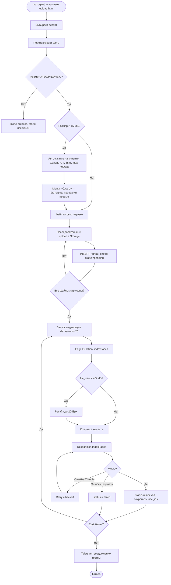
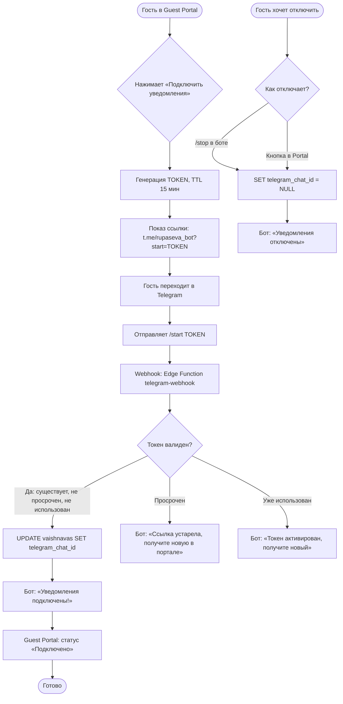

# Photo Gallery & Face Search — Функциональные требования

**Версия**: 1.3 (чеклисты по фазам: Must Have + Should Have, пересчёт оценок)
**Дата**: 2026-02-08
**Источник**: Photo-gallery-business-logic Short (PDF) + PLAN-dev-and-photos.md
**Статус**: Согласование

---

## Проблема

После каждого ретрита фотограф делает сотни фото. Сейчас фото раздаются через Google Drive или чат — хаотично, без структуры. Гости не могут быстро найти фото с собой среди 700 снимков. Часть гостей вообще не получает фото, потому что не видит ссылку в чате.

## Решение

Встроенная фото-галерея в системе ашрама с AI-поиском лиц. Фотограф загружает фото в админке, гости видят галерею в Guest Portal и находят себя за 2 секунды одной кнопкой. Telegram-бот уведомляет когда появляются новые фото.

## Метрики успеха

| Метрика | Цель | Как измеряем |
|---------|------|-------------|
| Доля гостей, просмотревших фото | > 70% | face_search_log / retreat_registrations |
| Доля гостей, нашедших себя | > 40% | face_tags COUNT DISTINCT vaishnava_id |
| Время от загрузки до просмотра | < 5 мин | uploaded_at → первый SELECT по retreat_id |
| Время поиска «Найти себя» | < 3 сек | search-face response time |
| Подписка на Telegram-бота | > 50% | vaishnavas WHERE telegram_chat_id IS NOT NULL |

---

## Акторы

| Роль | Кто это | Что делает в системе |
|------|---------|---------------------|
| **Фотограф** | Человек с камерой на ретрите. Имеет отдельную роль (`upload_photos`). Не суперпользователь | Загружает фото пачками, удаляет неудачные, следит за индексацией |
| **Гость** | Участник ретрита. Зарегистрирован через Guest Portal | Смотрит все фото, ищет себя, скачивает, подключает Telegram |
| **Система** | Бэкенд (Edge Functions + AWS Rekognition + Telegram Bot) | Индексирует лица, ищет совпадения, отправляет уведомления |
| **Администратор** | Суперпользователь системы | Управляет permission фотографа, видит аналитику поисков |

---

## User Stories

### US-1: Фотограф загружает фото с ретрита

```
Как фотограф,
я хочу загрузить пачку фото за один раз,
чтобы не тратить время на загрузку по одному.

Acceptance Criteria:
- Given я на странице загрузки фото и выбрал ретрит
- When я перетаскиваю 100 фото в зону загрузки
- Then система показывает превью всех файлов
  AND я вижу прогресс загрузки (34/100, скорость, текущий файл)
  AND файлы с неподдерживаемым форматом (не JPEG/PNG/HEIC) помечены с пояснением
  AND файлы > 15 МБ автоматически сжимаются на клиенте до ~12 МБ (качество 85%)
  AND сжатые файлы помечены меткой «Сжато» — фотограф может проверить качество
  AND после загрузки автоматически запускается индексация лиц
  AND я могу закрыть страницу — незавершённая индексация продолжится позже
```

### US-2: Гость просматривает фотогалерею

```
Как гость ретрита,
я хочу видеть все фото с моего ретрита,
чтобы сохранить воспоминания.

Acceptance Criteria:
- Given я авторизован в Guest Portal и зарегистрирован на ретрит
- When я открываю раздел «Фото»
- Then я вижу все фото ретрита в виде сетки с миниатюрами
  AND фото сгруппированы по дням
  AND по клику на фото открывается полноразмерная версия
  AND я могу скачать отдельное фото
  AND я вижу кнопку «Найти себя»
```

### US-3: Гость ищет себя на фото

```
Как гость ретрита,
я хочу найти все фото, где я есть,
чтобы не листать 700 снимков вручную.

Acceptance Criteria:
- Given я в галерее ретрита и у меня есть фото профиля
- When я нажимаю «Найти себя»
- Then за 1-3 секунды система показывает все фото, где я найден
  AND рядом с каждым фото — процент уверенности
  AND активируется фильтр «Фото со мной»
  AND я могу скачать все свои фото

- Given у меня НЕТ фото профиля
- When я нажимаю «Найти себя»
- Then система предлагает сделать селфи (мобильный) или загрузить фото
  AND после загрузки — поиск запускается автоматически

- Given поиск не нашёл совпадений
- When результат — 0 фото
- Then система показывает подсказку: «Попробуйте другое фото (крупный план, хорошее освещение)»
```

### US-4: Гость подключает Telegram-уведомления

```
Как гость ретрита,
я хочу получать уведомления в Telegram когда появляются новые фото,
чтобы не проверять сайт вручную.

Acceptance Criteria:
- Given я в Guest Portal
- When я нажимаю «Подключить уведомления»
- Then вижу кнопку/ссылку для перехода в Telegram-бота
  AND после отправки /start TOKEN в боте — получаю подтверждение
  AND в Guest Portal статус меняется на «Подключено»

- Given я подключил бота и фотограф загрузил новые фото
- When индексация завершена
- Then я получаю сообщение: «Новые фото с ретрита! Посмотреть →»

- Given я хочу отключить уведомления
- When я отправляю /stop боту ИЛИ нажимаю «Отключить» в Guest Portal
- Then уведомления прекращаются
```

### US-5: Фотограф удаляет неудачные фото

```
Как фотограф,
я хочу удалить некачественные фото,
чтобы гости видели только хорошие снимки.

Acceptance Criteria:
- Given я на странице управления фото
- When я выбираю одно или несколько фото и нажимаю «Удалить»
- Then система спрашивает подтверждение: «Удалить N фото? Нельзя отменить»
  AND после подтверждения — фото, файлы и данные о лицах удалены полностью
  AND удалённые лица не всплывают в результатах поиска
```

### US-6: Гость без регистрации на ретрит не видит фото

```
Как система,
я хочу показывать фото только участникам ретрита,
чтобы обеспечить приватность.

Acceptance Criteria:
- Given пользователь НЕ зарегистрирован на данный ретрит
- When он пытается открыть галерею этого ретрита
- Then он не видит фото (RLS блокирует)
  AND получает сообщение: «Фото доступны только участникам ретрита»
```

---

## User Flows

### Flow 1: Загрузка и индексация фото (Фотограф)

```
Фотограф                          Система                         AWS Rekognition
    │                                 │                                 │
    ├─→ Открывает photos/upload.html  │                                 │
    ├─→ Выбирает ретрит              │                                 │
    ├─→ Перетаскивает 100 фото       │                                 │
    │                                 │                                 │
    │   ┌─ Подготовка на клиенте ─┐  │                                 │
    │   │ Формат: JPEG/PNG/HEIC?  │  │                                 │
    │   │ ❌ 2 файла: неверный    │  │                                 │
    │   │    формат (BMP, TIFF)   │  │                                 │
    │   │ ⚠️ 3 файла > 15 МБ →   │  │                                 │
    │   │    авто-сжатие (85%)    │  │                                 │
    │   │    метка «Сжато»        │  │                                 │
    │   │ ✅ 98 файлов готовы     │  │                                 │
    │   └─────────────────────────┘  │                                 │
    │                                 │                                 │
    ├─→ Нажимает «Загрузить»         │                                 │
    │                                 │                                 │
    │   ┌─ Последовательный upload ─┐ │                                 │
    │   │ Файл 1/97 → Storage      ├─┤─→ INSERT retreat_photos         │
    │   │ Файл 2/97 → Storage      ├─┤─→ INSERT retreat_photos         │
    │   │ ...                       │ │                                 │
    │   │ [████████░░░] 34/97       │ │                                 │
    │   │ Файл 97/97 → Storage     ├─┤─→ INSERT retreat_photos         │
    │   └───────────────────────────┘ │                                 │
    │                                 │                                 │
    │   ┌─ Автоиндексация батчами ──┐ │                                 │
    │   │ Batch 1 (фото 1-20)      ├─┤─→ Edge Function index-faces ──→├─→ IndexFaces ×20
    │   │ Batch 2 (фото 21-40)     ├─┤─→ Edge Function index-faces ──→├─→ IndexFaces ×20
    │   │ ...                       │ │   (ресайз >4.5 МБ)             │
    │   │ [██████░░░░] 60/97        │ │                                 │
    │   │ Batch 5 (фото 81-97)     ├─┤─→ Edge Function index-faces ──→├─→ IndexFaces ×17
    │   └───────────────────────────┘ │                                 │
    │                                 │                                 │
    │                                 ├─→ Telegram: «Новые фото!» ──→ гостям
    │                                 │                                 │
    ✅ Готово: 97 фото, 247 лиц      │                                 │
```

### Flow 2: Поиск себя на фото (Гость)

```
Гость                              Система                         AWS Rekognition
    │                                 │                                 │
    ├─→ Открывает Guest Portal        │                                 │
    ├─→ Раздел «Фото»               │                                 │
    │                                 │                                 │
    │   ┌─ Галерея ──────────────┐   │                                 │
    │   │ 📷📷📷📷📷📷📷📷    │   │                                 │
    │   │ 📷📷📷📷📷📷📷📷    │   │                                 │
    │   │ День 1 · День 2 · ...  │   │                                 │
    │   │                        │   │                                 │
    │   │    [🔍 Найти себя]     │   │                                 │
    │   └────────────────────────┘   │                                 │
    │                                 │                                 │
    ├─→ Нажимает «Найти себя»        │                                 │
    │                                 │                                 │
    │   ┌─ Есть фото профиля? ──┐    │                                 │
    │   │ ДА → берём из Storage  │    │                                 │
    │   │ НЕТ → предлагаем:     │    │                                 │
    │   │   📱 Сделать селфи     │    │                                 │
    │   │   📁 Загрузить файл    │    │                                 │
    │   └────────────────────────┘    │                                 │
    │                                 │                                 │
    │                                 ├─→ Edge Function search-face     │
    │                                 │   1. Загрузить фото гостя      │
    │                                 │   2. Ресайз если > 4.5 МБ     │
    │                                 ├──────────────────────────────→  │
    │                                 │   SearchFacesByImage            │
    │                                 │   (1 вызов, 1-2 сек)           │
    │                                 │  ←──────────────────────────── │
    │                                 │   3. Сохранить face_tags       │
    │                                 │   4. Вернуть photo_ids         │
    │                                 │                                 │
    │   ┌─ Результат ────────────┐    │                                 │
    │   │ «Найдено 23 фото!»    │    │                                 │
    │   │                        │    │                                 │
    │   │ [✅ Фото со мной]      │    │                                 │
    │   │ 🟢📷 🟢📷 🟢📷 📷    │    │                                 │
    │   │ 🟢📷 📷 🟢📷 📷 📷   │    │                                 │
    │   │                        │    │                                 │
    │   │ 🟢 = с вами (95%)     │    │                                 │
    │   └────────────────────────┘    │                                 │
    │                                 │                                 │
    ├─→ Скачивает «Все мои фото»     │                                 │
    ✅                                │                                 │
```

### Flow 3: Подключение Telegram-уведомлений (Гость)

```
Гость                    Guest Portal              Edge Function           Telegram
  │                          │                          │                      │
  ├─→ «Подключить            │                          │                      │
  │    уведомления»          │                          │                      │
  │                          ├─→ Генерирует TOKEN       │                      │
  │                          │   (UUID, TTL 15 мин)     │                      │
  │                          │                          │                      │
  │   ┌──────────────────┐   │                          │                      │
  │   │ Подключить ТГ:   │   │                          │                      │
  │   │ [Открыть бота →] │   │                          │                      │
  │   │ t.me/rupaseva_bot│   │                          │                      │
  │   │ ?start=abc123... │   │                          │                      │
  │   └──────────────────┘   │                          │                      │
  │                          │                          │                      │
  ├─→ Нажимает ссылку ──────────────────────────────────────────────→ Telegram
  │                          │                          │                      │
  ├─→ /start abc123...  ──────────────────────────────────────────→ webhook
  │                          │                          │                      │
  │                          │                          ├─→ Валидация TOKEN    │
  │                          │                          │   ✅ валиден         │
  │                          │                          │                      │
  │                          │                          ├─→ UPDATE vaishnavas  │
  │                          │                          │   SET telegram_chat_id
  │                          │                          │                      │
  │                          │                          ├─→ Ответ бота ──────→ │
  │                          │                          │   «Привет, Радха!    │
  │  ←──────────────────────────────────────────────────│    Уведомления       │
  │   «Уведомления                                     │    подключены ✓»     │
  │    подключены ✓»         │                          │                      │
  │                          │                          │                      │
  │   ... позже ...          │                          │                      │
  │                          │                          │                      │
  │                          │   Фотограф загрузил      │                      │
  │                          │   новые фото             │                      │
  │                          │                          ├─→ send-notification  │
  │  ←────────────────────────────────────────────────── «Новые фото с        │
  │   push в Telegram        │                          │  ретрита! →»        │
  ✅                         │                          │                      │
```

### Flow 4: Удаление фото (Фотограф)

```
Фотограф                       Система                      AWS Rekognition
    │                              │                              │
    ├─→ photos/manage.html         │                              │
    ├─→ Выбирает 5 фото           │                              │
    ├─→ «Удалить выбранные (5)»   │                              │
    │                              │                              │
    │   ┌────────────────────┐     │                              │
    │   │ Удалить 5 фото?   │     │                              │
    │   │ Нельзя отменить.  │     │                              │
    │   │ [Отмена] [Удалить]│     │                              │
    │   └────────────────────┘     │                              │
    │                              │                              │
    ├─→ Подтверждает               │                              │
    │                              ├─→ Edge Function delete-photos │
    │                              │   1. Получить face_ids       │
    │                              ├──────────────────────────→   │
    │                              │   DeleteFaces(face_ids)      │
    │                              │  ←────────────────────────── │
    │                              │   2. DELETE face_tags        │
    │                              │   3. DELETE photo_faces      │
    │                              │   4. DELETE retreat_photos   │
    │                              │   5. Storage.remove(paths)   │
    │                              │                              │
    ✅ «5 фото удалено»           │                              │
```

---

## BPMN-диаграммы (Mermaid)

### Процесс загрузки фото



### Процесс поиска себя


### Процесс подключения Telegram



---

## Приоритизация (MoSCoW)

**В работу берём: Must Have + Should Have. Could Have — после MVP.**

### Must Have

- Загрузка фото пачкой (drag & drop + авто-сжатие)
- Просмотр галереи с миниатюрами
- Удаление фото (с каскадом Rekognition + Storage + БД)
- Индексация лиц (IndexFaces, батчи по 20)
- Поиск себя (SearchFacesByImage, мгновенный)
- RLS: фото видят только участники ретрита
- Роль «Фотограф» (permission `upload_photos`)

### Should Have

- Группировка по дням ретрита
- Прогрессбар загрузки и индексации
- Telegram-уведомления (бот + привязка + /start /stop)
- Fallback: селфи для гостей без фото профиля
- Кнопка «Переиндексировать» (пересоздание коллекции)
- Bulk delete с мультивыбором

### Could Have (после MVP)

- Скачивание всех своих фото zip-архивом
- Подписи к фото (caption)
- Аналитика поисков (face_search_log)
- QR-код для Telegram на ресепшене

### Won't Have

- Видео
- Комментарии к фото
- Лайки / избранное
- Поиск по нескольким ретритам
- Telegram как интерфейс поиска (только уведомления)

---

## Нефункциональные требования

### Производительность

| Параметр | Требование |
|----------|-----------|
| Загрузка страницы галереи | < 3 сек (thumbnails через CDN) |
| Поиск «Найти себя» | < 3 сек (один вызов Rekognition) |
| Upload 100 фото | Последовательно, с retry |
| Индексация 100 фото | ~50-75 сек (5 батчей по 20) |

### Безопасность

| Параметр | Реализация |
|----------|-----------|
| Доступ к фото | RLS: только участники ретрита |
| Загрузка/удаление | Permission `upload_photos` |
| AI-таблицы (photo_faces, face_tags) | Запись: только service_role (Edge Functions) |
| Telegram-привязка | Одноразовый TOKEN с TTL 15 мин |
| AWS ключи | Supabase Edge Function Secrets |

### Ограничения

| Параметр | Значение |
|----------|---------|
| Макс. размер файла | Без жёсткого лимита (> 15 МБ — авто-сжатие на клиенте) |
| Форматы | JPEG, PNG, HEIC (остальные отклоняются с пояснением) |
| Макс. лиц на фото (Rekognition) | Индексируются все обнаруженные |
| Мин. размер лица (Rekognition) | 80×80 px |
| Порог уверенности поиска | 80% |
| TTL Telegram-токена | 15 минут |

---

## Фаза 1. Галерея (без AI)

### 1.1 Структура данных (DB)

**Таблица `retreat_photos`:**

| Поле | Тип | Описание |
|------|-----|----------|
| id | UUID PK | |
| retreat_id | UUID FK → retreats | Ретрит |
| storage_path | TEXT | Путь в Supabase Storage: `{retreat_id}/{uuid}.jpg` |
| uploaded_by | UUID FK → profiles | Кто загрузил |
| uploaded_at | TIMESTAMPTZ | Когда загружено |
| width | INT | Ширина (px) |
| height | INT | Высота (px) |
| file_size | INT | Размер (байты) |
| day_number | INT | День ретрита (для группировки) |
| caption | TEXT | Подпись (опционально) |
| index_status | TEXT | `pending` / `processing` / `indexed` / `failed` |
| index_error | TEXT | Текст ошибки если failed |

**RLS-политики:**

- SELECT: участники ретрита (retreat_registrations.status IN ('guest', 'team'))
- INSERT/DELETE: пользователи с permission `upload_photos`
- Суперпользователи обходят RLS

### 1.2 Storage (bucket `retreat-photos`)

- Public bucket в Supabase Storage
- Конвенция путей: `{retreat_id}/{uuid}.jpg`
- Thumbnails: CDN Image Transforms (генерация на лету, без хранения)
- Кэш: `Cache-Control: max-age=31536000` (1 год, фото не меняются)

### 1.3 Загрузка фото (frontend + Edge Function)

**Подготовка на клиенте (ПЕРЕД upload):**

- Допустимые форматы: JPEG, PNG, HEIC/HEIF
  - HTML: `<input type="file" accept="image/jpeg,image/png,image/heic" multiple>`
- Неподдерживаемые форматы (BMP, TIFF, GIF, WebP и пр.):
  - Файл помечается красным с пояснением: «Формат {ext} не поддерживается. Конвертируйте в JPEG»
  - Исключается из загрузки
- Автосжатие крупных файлов:
  - Файлы **> 15 МБ** автоматически сжимаются на клиенте через Canvas API (качество 85%, max 4096px по длинной стороне)
  - Сжатый файл помечается меткой **«Сжато: {исходный размер} → {новый размер}»**
  - Фотограф может проверить качество превью перед загрузкой
  - Если после сжатия файл всё ещё > 15 МБ — показать предупреждение: «Не удалось сжать {name} до допустимого размера. Обработайте вручную»
- Файлы с нормальным размером (< 15 МБ) загружаются без изменений
- Остальные файлы НЕ блокируются из-за проблем с отдельными файлами

**Загрузка:**

- Последовательная (по одному файлу — стабильнее на плохом интернете)
- Прогрессбар: номер файла / всего, текущий файл, скорость
- Кнопки «Пауза» / «Отмена»
- Retry до 3 раз с exponential backoff при ошибке
- Сохранение метаданных в БД (width, height, file_size, day_number)

**Роль «Фотограф»:**

- Отдельная permission `upload_photos` в таблице permissions
- Не суперпользователь — только загрузка/удаление фото

### 1.4 Просмотр галереи

- Получение списка фото по retreat_id
- Группировка по дням ретрита (day_number)
- Отображение сеткой (thumbnails через CDN Image Transforms: width=400)
- Увеличение по клику (полный размер)
- Скачивание отдельного фото

### 1.5 Удаление фото (админ)

**Способ удаления: жёсткое (hard delete)**

Обоснование: soft delete (deleted_at) усложняет каскад с Rekognition и не имеет практического смысла для фото ретрита. Восстановление из корзины не требуется.

**UI:**

- Кнопка «Удалить» на фото + диалог подтверждения
- Bulk delete: выбор нескольких фото → «Удалить выбранные (N)»

**Проверка прав:** permission `upload_photos` (backend, RLS)

**Каскад удаления (Edge Function `delete-photos`):**

1. Получить все face_id из photo_faces для удаляемых фото
2. Rekognition.DeleteFaces(CollectionId, FaceIds) — удалить лица из коллекции
3. DELETE FROM face_tags WHERE photo_id = ...
4. DELETE FROM photo_faces WHERE photo_id = ... (или CASCADE)
5. DELETE FROM retreat_photos WHERE id = ...
6. supabase.storage.from('retreat-photos').remove([storage_path])

**Обработка ошибок удаления:**

- Если файл уже удалён в Storage — продолжаем (удаляем запись в БД, логируем warning)
- Если ошибка Storage — показать пользователю: «Не удалось удалить файл {name} из хранилища. Запись в базе сохранена. Обратитесь к администратору»
- Если ошибка Rekognition.DeleteFaces — продолжаем (лица-«сироты» безвредны, не вернутся в поиск без фото)
- Каскад НЕ прерывается из-за ошибки одного шага — best-effort cleanup

### Чеклист Фазы 1

**Must Have:**

- [ ] Роль «Фотограф» (permission `upload_photos`)
- [ ] Миграция: таблица `retreat_photos`
- [ ] Supabase Storage bucket `retreat-photos` + RLS
- [ ] RLS на retreat_photos (участники читают, фотограф пишет)
- [ ] Admin: upload.html — drag & drop, авто-сжатие > 15 МБ, последовательная загрузка с retry
- [ ] Admin: manage.html — удаление фото (каскад Storage + БД)
- [ ] Guest Portal: галерея фото ретрита
- [ ] Thumbnails через CDN Image Transforms

**Should Have:**

- [ ] Группировка фото по дням ретрита (day_number)
- [ ] Прогрессбар загрузки (номер/всего, скорость, текущий файл, пауза/отмена)
- [ ] Bulk delete: мультивыбор фото + «Удалить выбранные (N)»
- [ ] Скачивание отдельного фото

**Итого Фаза 1: 14–18 часов (обычный dev) / ~5.5 часа (Human+Claude)**

---

## Фаза 2. Распознавание лиц (AI)

### 2.1 Интеграция AWS Rekognition

- AWS SDK в Edge Functions (Deno)
- Ключи: Supabase Edge Function Secrets (AWS_ACCESS_KEY_ID, AWS_SECRET_ACCESS_KEY, AWS_REGION=ap-south-1)
- IAM user: `srsk-rekognition` (policy: `SrskRekognitionOnly`)
- Статус: **ГОТОВО** (настроено 07.02.2026)

### 2.2 Коллекции лиц по ретритам

- Одна коллекция на ретрит: `retreat_{retreat_id}`
- Создаётся при первом вызове index-faces для ретрита
- Проверка существования: try CreateCollection, catch AlreadyExists
- AI включён для всех ретритов по умолчанию (без отдельного переключателя)
  - Обоснование: toggle «включить AI» усложняет UX без пользы. Индексация происходит только при загрузке фото — если фото не загружены, AI не работает автоматически

### 2.3 Индексация фото (IndexFaces)

**Триггер:** фронтенд вызывает Edge Function после batch upload (или кнопка «Индексировать оставшиеся» для pending фото).

**Ресайз перед отправкой в Rekognition:**

- AWS Rekognition принимает максимум **5 МБ** на изображение
- Edge Function `index-faces` ОБЯЗАНА ресайзить фото перед отправкой:
  1. Скачать оригинал из Storage
  2. Если file_size > 4.5 МБ — ресайзить до max 2048px по длинной стороне (качество 85%)
  3. Отправить ресайзнутое в Rekognition
  4. Оригинал в Storage НЕ трогать (хранится как есть)
- Библиотека для ресайза в Deno: `sharp` (через npm:sharp) или `imagescript`

**Батчинг:**

- Батчи по 20 фото (Sequential, не Parallel)
- Каждый батч — отдельный вызов Edge Function (~10-15 сек)
- Фронтенд вызывает в цикле, показывает прогресс
- Фотограф НЕ обязан ждать — может закрыть страницу

**Retry + backoff для Rekognition API:**

- При ошибке AWS (ThrottlingException, InternalServerError) — retry до 3 раз
- Backoff: 1с → 2с → 4с (exponential)
- При ProvisionedThroughputExceededException — backoff 5с → 10с → 20с
- При InvalidImageFormatException — пометить фото как `failed`, не ретраить

**Что сохраняем:**

| Таблица | Поля | Описание |
|---------|------|----------|
| photo_faces | photo_id, rekognition_face_id, bbox_x/y/w/h | Связь фото ↔ лицо в коллекции |
| retreat_photos.index_status | pending → processing → indexed / failed | Статус индексации |
| retreat_photos.index_error | TEXT | Текст ошибки если failed |

### 2.4 Поиск себя (SearchFacesByImage)

**Что делает пользователь:**

Нажимает «Найти себя» в Guest Portal.

**Источник фото для поиска — 3 уровня fallback:**

1. **Фото профиля** (vaishnava-photos bucket) — основной вариант
2. **Селфи прямо сейчас** — если фото профиля нет:
   - Мобильный: `<input type="file" accept="image/*" capture="user">`
   - Десктоп: загрузить файл
   - Фото используется только для поиска (не сохраняется в профиль, если гость не хочет)
3. **Нет возможности** — кнопка неактивна, подсказка: «Загрузите фото профиля, чтобы AI мог найти вас на фотографиях ретрита»

**Что делает система (Edge Function `search-face`):**

1. Загружает фото гостя из Storage (или принимает загруженное селфи)
2. Ресайз если > 4.5 МБ (аналогично index-faces)
3. Rekognition.SearchFacesByImage(CollectionId=retreat_{id}, FaceMatchThreshold=80, MaxFaces=100)
4. По FaceId → JOIN photo_faces → photo_id
5. UPSERT в face_tags (ON CONFLICT DO UPDATE SET confidence)
6. INSERT в face_search_log
7. Возвращает { matched_photo_ids, total }

**Время ответа:** 1-2 секунды (один вызов Rekognition)

**При 0 совпадений:** подсказка «Попробуйте загрузить другое фото (крупный план лица, хорошее освещение)»

### 2.5 Сохранение результатов (face_tags)

**Таблица `face_tags`:**

| Поле | Тип | Описание |
|------|-----|----------|
| id | UUID PK | |
| photo_id | UUID FK → retreat_photos | Фото |
| vaishnava_id | UUID FK → vaishnavas | Гость |
| confidence | FLOAT | Уверенность AI (0-1) |
| bbox_x, bbox_y, bbox_w, bbox_h | FLOAT | Координаты лица (%) |
| created_at | TIMESTAMPTZ | |
| UNIQUE | (photo_id, vaishnava_id) | Один человек на фото = одна запись |

- Используется **upsert** (ON CONFLICT DO UPDATE SET confidence)
- При первом поиске — создаётся запись
- При повторном — обновляется confidence

### Чеклист Фазы 2

**Must Have:**

- [ ] Миграция: таблицы `photo_faces`, `face_tags`
- [ ] Edge Function `index-faces` (ресайз >4.5 МБ, батчи по 20, retry с backoff)
- [ ] Создание коллекций `retreat_{id}` (auto-create при первом вызове)
- [ ] Edge Function `search-face` (SearchFacesByImage, threshold 80%)
- [ ] UPSERT face_tags (ON CONFLICT DO UPDATE SET confidence)
- [ ] Интеграция «Найти себя» в Guest Portal (основной flow: фото профиля)
- [ ] Каскад удаления: DeleteFaces при удалении фото

**Should Have:**

- [ ] Fallback: селфи / загрузка файла для гостей без фото профиля
- [ ] Кнопка «Переиндексировать» (пересоздание коллекции + повторная индексация всех фото)
- [ ] Прогрессбар индексации (номер батча / всего, количество проиндексированных лиц)

**Итого Фаза 2: 13–17 часов (обычный dev) / ~5.0 часов (Human+Claude)**

---

## Фаза 3. Telegram (уведомления) — Should Have

### 3.1 Telegram-бот и webhook

- Бот: @rupaseva_bot (или аналог), регистрация через @BotFather
- Webhook: Edge Function `telegram-webhook`
- Команды: `/start TOKEN`, `/stop`

### 3.2 Привязка Telegram к гостю (/start TOKEN)

**Архитектура привязки: поле в vaishnavas (не отдельная таблица)**

Обоснование: отдельная таблица `telegram_links` (из первоначального ФТ) избыточна для MVP. Один гость = один Telegram-чат. Поле `vaishnavas.telegram_chat_id` достаточно.

Если в будущем понадобится: несколько ботов, история привязок, is_active/linked_at — тогда выносить в отдельную таблицу.

**Новое поле:**

```sql
ALTER TABLE vaishnavas ADD COLUMN telegram_chat_id BIGINT;
```

**Таблица токенов `telegram_link_tokens`:**

| Поле | Тип | Описание |
|------|-----|----------|
| id | UUID PK | |
| token | UUID UNIQUE | Одноразовый токен |
| vaishnava_id | UUID FK → vaishnavas | Кому принадлежит |
| expires_at | TIMESTAMPTZ | TTL 15 минут |
| used | BOOLEAN | Использован ли |
| used_at | TIMESTAMPTZ | Когда использован (для аудита) |
| created_at | TIMESTAMPTZ | |

**Flow:**

1. Гость в Guest Portal нажимает «Подключить уведомления»
2. Фронтенд создаёт токен (INSERT INTO telegram_link_tokens, expires_at = now() + 15 мин)
3. Показывает ссылку: `https://t.me/rupaseva_bot?start=TOKEN`
4. Гость нажимает → Telegram → `/start TOKEN`
5. Webhook (Edge Function):
   - Извлекает telegram_user_id, chat_id, username, текст `/start TOKEN`
   - Валидация: токен существует AND expires_at > now() AND used = false
   - Если валиден: UPDATE vaishnavas SET telegram_chat_id = chat_id; UPDATE tokens SET used = true, used_at = now()
   - Ответ бота: «Привет, {spiritual_name}! Уведомления подключены»
6. Guest Portal показывает «Уведомления подключены» (проверяет telegram_chat_id IS NOT NULL)

**Идемпотентность:**

- Повторный `/start` с использованным токеном → «Этот токен уже активирован. Откройте портал для новой ссылки»
- Гость уже привязан + новый токен → перепривязка (обновляем chat_id), подтверждаем
- Один Telegram → два гостя → разрешаем перепривязку (последний токен побеждает), логируем

### 3.3 Отписка (/stop)

- Гость пишет `/stop` боту → UPDATE vaishnavas SET telegram_chat_id = NULL
- Или в Guest Portal: кнопка «Отключить уведомления» → тот же UPDATE
- Бот отвечает: «Уведомления отключены. Вы можете подключить их снова в Guest Portal»

### 3.4 Уведомления

**Типы:**

1. «Новые фото с ретрита!» — при загрузке фотографом (после завершения upload)
2. «Мы нашли вас на N фотографиях! Посмотреть →» — после SearchFacesByImage (если есть совпадения)

**Содержание:** текстовое сообщение + ссылка на галерею в Guest Portal

**Edge Function `send-notification`:**

- Принимает: retreat_id, тип уведомления, список chat_id
- Отправляет через Telegram Bot API (sendMessage)
- Rate limit: не более 30 сообщений/сек (лимит Telegram)

### 3.5 Обработка ошибок

- Неверный или просроченный токен → понятное сообщение
- `/start` без токена → «Для подключения уведомлений перейдите в Guest Portal»
- Telegram API rate limit → retry с backoff (1с → 2с → 4с)
- Chat not found (гость заблокировал бота) → пометить telegram_chat_id = NULL, логировать

### Чеклист Фазы 3

**Should Have (вся фаза):**

- [ ] Бот @rupaseva_bot: регистрация через @BotFather, настройка команд
- [ ] Edge Function `telegram-webhook` (webhook приём + валидация)
- [ ] Миграция: поле `vaishnavas.telegram_chat_id`, таблица `telegram_link_tokens`
- [ ] /start TOKEN — генерация токена, deep link, привязка chat_id
- [ ] /stop — отписка (SET telegram_chat_id = NULL)
- [ ] Edge Function `send-notification` (отправка сообщений, rate limit 30/сек)
- [ ] Уведомления: «Новые фото!» после загрузки, «Найдены фото с вами!» после поиска
- [ ] Guest Portal: кнопки «Подключить» / «Отключить» уведомления
- [ ] Обработка ошибок: просроченный/использованный токен, заблокированный бот

**Итого Фаза 3: 8–12 часов (обычный dev) / ~4.3 часа (Human+Claude)**

---

## Итоговая оценка (Must Have + Should Have)

| Фаза | Scope | Обычный dev | Human + Claude (при 3 ч/день) |
|------|-------|-----------|-------------------------------|
| Фаза 1 — Галерея | Must + Should | 14–18 ч (5-6 дней) | ~5.5 ч (2 дня) |
| Фаза 2 — Face Recognition | Must + Should | 13–17 ч (5-6 дней) | ~5.0 ч (2 дня) |
| Фаза 3 — Telegram | Should | 8–12 ч (3-4 дня) | ~4.3 ч (1.5 дня) |
| **Итого** | **Must + Should** | **35–47 ч (13-16 дней)** | **~14.8 ч (~5 дней)** |

---

## Изменения относительно исходного ФТ (PDF)

| # | Было (PDF) | Стало | Обоснование |
|---|-----------|-------|-------------|
| 1 | Лимит файла 5 МБ, отклонение | **Авто-сжатие > 15 МБ на клиенте** | Камеры дают 7-15 МБ, некоторые 20+ МБ. Не отклоняем — сжимаем автоматически, помечаем для проверки |
| 2 | Мягкое удаление (deleted_at) | **Жёсткое удаление + каскад** | Soft delete усложняет каскад с Rekognition, не нужен для фото |
| 3 | Отдельная таблица telegram_links | **Поле vaishnavas.telegram_chat_id** | Проще для MVP, один гость = один чат |
| 4 | Нет ресайза перед Rekognition | **Обязательный ресайз >4.5 МБ** | Rekognition API лимит 5 МБ на изображение |
| 5 | Нет UX ошибки формата/размера | **Inline сообщения при валидации** | Явное требование из ФТ, детализировано |
| 6 | Переключатель «включить AI» | **AI включён всегда** | Toggle усложняет UX без пользы, индексация только при загрузке |
| 7 | used_at отсутствует в токенах | **Добавлено поле used_at** | Для аудита, когда был использован токен |
